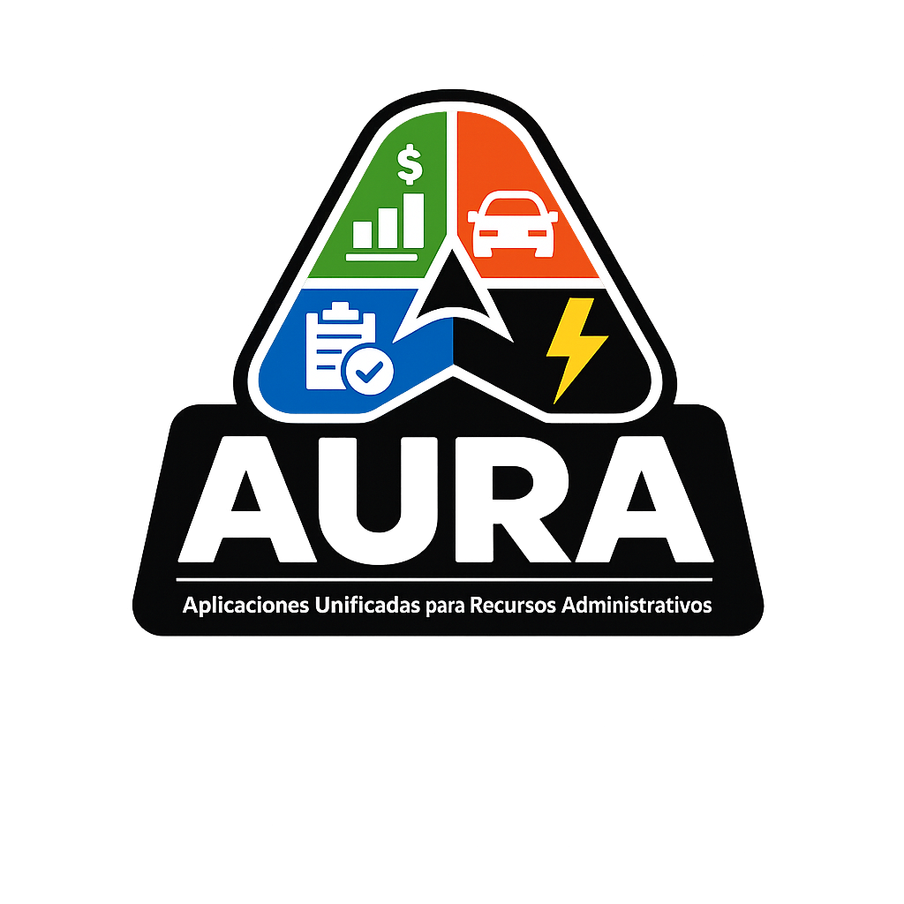

<div align="center">



# Product Requirements Document (PRD)
## Plataforma Aura - Suite de Gestión Empresarial sobre WordPress
### Sistema de Permisos Granulares por Usuario (CBAC)

> **AURA**: **A**plicaciones **U**nificadas para **R**ecursos **A**dministrativos

</div>


---

## 1. Resumen Ejecutivo

### 1.1 Visión del Producto
**Aura (Aplicaciones Unificadas para Recursos Administrativos)** es una suite modular de gestión empresarial construida sobre WordPress, aprovechando su ecosistema maduro, seguridad probada y extensibilidad nativa. La plataforma integra **siete módulos críticos** (Finanzas, Inventario, Biblioteca, Vehículos, Formularios, Estudiantes/Inscripciones, Electricidad) que comparten un sistema unificado de usuarios, roles y permisos, permitiendo a pequeñas y medianas empresas, fundaciones e institutos gestionar sus operaciones sin complejidad técnica.

**Caso de Uso Principal**: Instituto tipo rancho/finca con actividades múltiples (voluntarios, misioneros, estudiantes, alquiler de espacios a iglesias) que requiere gestión integrada de recursos financieros, herramientas, biblioteca, vehículos, inscripciones con control de becas y pagos, y consumos eléctricos.

### 1.2 Propuesta de Valor Única
- **Velocidad de Implementación**: Solución funcional en 3-4 semanas vs 6-12 meses de desarrollo custom
- **Ecosistema Probado**: Seguridad y actualizaciones gestionadas por la comunidad WordPress (43% de la web)
- **Extensibilidad Nativa**: Aprovecha 60,000+ plugins existentes y arquitectura plugin-based de WordPress
- **Costo-Eficiencia**: Inversión 70% menor vs desarrollo desde cero, con mantenimiento simplificado

### 1.3 Objetivos Estratégicos de Negocio
1. **Time-to-Market Agresivo**: MVP funcional en 8-10 semanas con los 7 módulos operativos
2. **Escalabilidad Validada**: Aprovechar infraestructura WordPress probada en millones de sitios
3. **Mantenibilidad Sostenible**: Actualizaciones de seguridad automáticas + parches de comunidad
4. **Flexibilidad Futura**: Fácil integración con APIs externas y nuevos plugins especializados
5. **Interoperabilidad de Módulos**: Los 7 módulos comparten datos (ej: Estudiantes → Finanzas, Inventario → Finanzas → Vehículos)

---

## 2. Segmentos de Usuarios y Casos de Uso

### 2.1 Usuarios Primarios

#### A. Pequeñas y Medianas Empresas
**Perfil**: Empresas de 5-100 empleados con necesidades de gestión operativa integrada

**Necesidades Críticas**:
- Control financiero centralizado (ingresos, egresos, donaciones, alquileres, becas)
- Gestión de inventario de herramientas y equipos (eléctricas, baterías, motor, sonido)
- Administración de biblioteca (préstamos de libros, control de devoluciones)
- Gestión de activos móviles (flota vehicular con mantenimientos)
- Recopilación de datos mediante formularios (inscripciones de estudiantes, encuestas)
- Monitoreo de consumos (electricidad, sistema de riego automatizado)
- Sistema único de usuarios sin duplicar credenciales

**Jobs-to-be-Done**:
- "Necesito que el jefe apruebe gastos antes de ejecutarlos"
- "Quiero saber cuándo un vehículo necesita mantenimiento según kilometraje"
- "Debo recopilar satisfacción de clientes mediante encuestas periódicas"
- "Necesito alertas cuando el consumo eléctrico exceda umbrales"

#### B. Sistema de Permisos Granulares (Capabilities por Usuario)
**Arquitectura flexible basada en capabilities personalizadas por módulo**

En lugar de roles fijos, cada usuario puede tener **permisos específicos asignados individualmente** organizados por módulo/app. El Administrador puede construir perfiles personalizados según las necesidades del puesto.

---

### 📦 MÓDULO: FINANZAS

**Capabilities disponibles** (se asignan por usuario):

| Capability | Descripción | Ejemplo de Uso |
|------------|-------------|----------------|
| `aura_finance_create` | Crear ingresos y egresos | Tesorero, Contador |
| `aura_finance_edit_own` | Editar propias transacciones | Tesorero (solo las suyas) |
| `aura_finance_edit_all` | Editar cualquier transacción | Administrador, Auditor |
| `aura_finance_delete_own` | Eliminar propias transacciones | Tesorero |
| `aura_finance_delete_all` | Eliminar cualquier transacción | Administrador |
| `aura_finance_approve` | Aprobar/rechazar gastos | Jefe, Director Financiero |
| `aura_finance_view_own` | Ver solo transacciones propias | Tesorero |
| `aura_finance_view_all` | Ver todas las transacciones | Auditor, Gerente |
| `aura_finance_charts` | Ver gráficos financieros | Cualquier rol que lo necesite |
| `aura_finance_export` | Exportar reportes a Excel/PDF | Auditor, Contador |
| `aura_finance_category_manage` | Gestionar categorías de ingresos/egresos | Administrador, Contador |

---

### 📦 MÓDULO: INVENTARIO Y MANTENIMIENTOS

**Capabilities disponibles** (para gestión de herramientas, equipos y mantenimientos periódicos):

| Capability | Descripción | Ejemplo de Uso |
|------------|-------------|----------------|
| `aura_inventory_create` | Crear/registrar artículos (herramientas, equipos) | Encargado de Inventario, Administrador |
| `aura_inventory_edit` | Editar datos de artículos | Encargado de Inventario |
| `aura_inventory_delete` | Eliminar artículos del inventario | Solo Administrador |
| `aura_inventory_view_all` | Ver todo el inventario | Cualquier usuario autorizado |
| `aura_inventory_checkout` | Registrar préstamo/salida de herramientas | Encargado de Almacén, Voluntario |
| `aura_inventory_checkin` | Registrar devolución de herramientas | Encargado de Almacén |
| `aura_inventory_maintenance_register` | Registrar mantenimiento realizado | Técnico de Mantenimiento |
| `aura_inventory_maintenance_schedule` | Configurar calendarios de mantenimiento periódico | Supervisor de Mantenimiento |
| `aura_inventory_maintenance_view` | Ver historial de mantenimientos | Administrador, Auditor |
| `aura_inventory_maintenance_alerts` | Recibir notificaciones de mantenimientos próximos | Técnico, Supervisor |
| `aura_inventory_maintenance_external` | Registrar servicios en talleres externos | Técnico de Mantenimiento |
| `aura_inventory_stock_min` | Configurar stock mínimo y alertas | Administrador, Supervisor |
| `aura_inventory_reports` | Ver reportes de disponibilidad y uso | Gerente, Supervisor |
| `aura_inventory_categories` | Gestionar categorías de inventario | Administrador |
| `aura_inventory_cost_tracking` | Ver costos de mantenimiento por equipo | Administrador, Finanzas |
| `aura_inventory_lifecycle` | Ver vida útil y depreciación de equipos | Administrador, Auditor |

**Categorías de Inventario para el Instituto**:
- **Herramientas Eléctricas**: Taladros, sierras, lijadoras, etc.
- **Herramientas de Batería**: Destornilladores, pulidoras portátiles, etc.
- **Herramientas de Motor 4 Tiempos**: Cortadoras de césped, generadores (requieren cambio de aceite periódico)
- **Herramientas de Motor 2 Tiempos**: Motosierra, desmalezadora, sopladores (requieren mezcla aceite/gasolina)
- **Equipos Hidráulicos**: Bomba de aire, compresor de aire, tanque precargado hidráulico (mantenimiento cada 6 meses)
- **Sistema de Riego**: Controladores, válvulas, sensores, aspersores
- **Equipo de Sonido**: Mixer, cabinas/parlantes, micrófonos, cables
- **Mobiliario**: Mesas, sillas, ventiladores, camas
- **Material de Limpieza**: Escobas, trapeadores, productos químicos
- **Equipos de Seguridad**: Extintores, botiquines, señalización

**Equipos con Mantenimiento Periódico Obligatorio**:
- **Bomba de Aire**: Mantenimiento cada 6 meses (limpieza de filtros, lubricación)
- **Compresor de Aire**: Mantenimiento cada 3 meses (cambio de aceite, revisión de válvulas)
- **Tanque Precargado Hidráulico**: Inspección cada 6 meses (presión, válvulas)
- **Motores 4 Tiempos**: Cambio de aceite cada 50 horas de uso o 3 meses
- **Motores 2 Tiempos**: Limpieza de bujía y filtro cada 25 horas de uso o 2 meses
- **Generador Eléctrico**: Cambio de aceite cada 100 horas o 6 meses

---

### 📚 MÓDULO: BIBLIOTECA

**Capabilities disponibles** (para gestión de préstamos de libros):

| Capability | Descripción | Ejemplo de Uso |
|------------|-------------|----------------|
| `aura_library_create` | Agregar libros al catálogo | Bibliotecario, Administrador |
| `aura_library_edit` | Editar información de libros | Bibliotecario |
| `aura_library_delete` | Eliminar libros del catálogo | Solo Administrador |
| `aura_library_view_catalog` | Ver catálogo completo de libros | Todos los usuarios autorizados |
| `aura_library_loan_create` | Registrar préstamo de libro | Bibliotecario |
| `aura_library_loan_return` | Registrar devolución de libro | Bibliotecario |
| `aura_library_loan_extend` | Extender plazo de préstamo | Bibliotecario |
| `aura_library_view_loans_own` | Ver solo préstamos propios | Cualquier usuario |
| `aura_library_view_loans_all` | Ver todos los préstamos activos | Bibliotecario, Administrador |
| `aura_library_reports` | Ver reportes de préstamos y estadísticas | Bibliotecario, Gerente |
| `aura_library_alerts` | Recibir alertas de devoluciones vencidas | Bibliotecario |

**Funcionalidades del Módulo Biblioteca**:
- **Catálogo de libros**: Registro con ISBN, autor, categoría, ubicación física
- **Préstamos**: Control de quién tiene qué libro, fecha de préstamo y devolución
- **Alertas automáticas**: Notificaciones de libros próximos a vencer o vencidos
- **Historial**: Registro completo de préstamos por libro y por usuario
- **Multas (opcional)**: Cálculo automático de multas por retraso
- **Reservas (opcional)**: Sistema de cola cuando libro no está disponible

---

### 🚗 MÓDULO: VEHÍCULOS

**Capabilities disponibles**:

| Capability | Descripción | Ejemplo de Uso |
|------------|-------------|----------------|
| `aura_vehicles_create` | Crear/registrar vehículos | Administrador de Flota |
| `aura_vehicles_edit` | Editar datos de vehículos | Administrador de Flota |
| `aura_vehicles_delete` | Eliminar vehículos | Solo Administrador |
| `aura_vehicles_exits_create` | Registrar salidas (mantenimiento, renta, personal) | Recepcionista, Operador |
| `aura_vehicles_exits_edit_own` | Editar propias salidas | Quien registró la salida |
| `aura_vehicles_exits_edit_all` | Editar cualquier salida | Supervisor de Flota |
| `aura_vehicles_km_update` | Actualizar kilometraje | Conductor, Operador |
| `aura_vehicles_view_all` | Ver todos los vehículos | Cualquier usuario autorizado |
| `aura_vehicles_reports` | Ver reportes y estadísticas | Gerente, Auditor |
| `aura_vehicles_alerts` | Recibir alertas de mantenimiento | Mecánico, Supervisor |

---

### 📝 MÓDULO: FORMULARIOS Y ENCUESTAS

**Capabilities disponibles**:

| Capability | Descripción | Ejemplo de Uso |
|------------|-------------|----------------|
| `aura_forms_submit` | Llenar y enviar formularios | Todos los usuarios |
| `aura_forms_create` | Crear nuevos formularios | Administrador, RRHH |
| `aura_forms_edit` | Editar formularios existentes | Administrador |
| `aura_forms_delete` | Eliminar formularios | Solo Administrador |
| `aura_forms_view_responses_own` | Ver solo respuestas propias | Usuario que llenó el formulario |
| `aura_forms_view_responses_all` | Ver todas las respuestas | RRHH, Analista de Datos |
| `aura_forms_export` | Exportar respuestas a CSV/Excel | Analista, Gerente |
| `aura_forms_analytics` | Ver análisis y gráficos de encuestas | Gerente, Director |

---

### 🎓 MÓDULO: ESTUDIANTES E INSCRIPCIONES

**Capabilities disponibles** (para gestión de inscripciones, becas y pagos):

| Capability | Descripción | Ejemplo de Uso |
|------------|-------------|----------------|
| `aura_students_create` | Crear/registrar estudiantes manualmente | Secretaría Académica, Administrador |
| `aura_students_edit` | Editar información de estudiantes | Secretaría Académica |
| `aura_students_delete` | Eliminar estudiantes | Solo Administrador |
| `aura_students_view_all` | Ver todos los estudiantes | Dirección, Finanzas |
| `aura_students_view_own` | Ver solo información propia | Estudiante |
| `aura_students_enrollments_manage` | Gestionar inscripciones a cursos | Secretaría Académica |
| `aura_students_scholarships_view` | Ver becas asignadas | Dirección, Finanzas |
| `aura_students_scholarships_assign` | Asignar/modificar becas | Director Académico, Administrador |
| `aura_students_payments_register` | Registrar pagos de estudiantes | Tesorería, Finanzas |
| `aura_students_payments_view_all` | Ver estado de pagos de todos | Tesorería, Auditor |
| `aura_students_payments_view_own` | Ver solo pagos propios | Estudiante |
| `aura_students_quotas_config` | Configurar esquemas de cuotas | Director Financiero |
| `aura_students_status_view` | Ver estado paz y salvo | Todos los autorizados |
| `aura_students_reports` | Ver reportes de inscripciones y pagos | Dirección, Finanzas |

**Funcionalidades del Módulo Estudiantes**:
- **Registro de estudiantes**: Desde formulario de inscripción o creación manual
- **Gestión de cursos**: Inscripción a capacitaciones con costos configurables
- **Sistema de becas**: Internas (instituto) y externas con porcentajes personalizables
- **Esquemas de pago flexibles**:
  - Pago completo (100%)
  - Pago inicial + cuotas mensuales
  - Becas parciales (50%, 75%, 100%)
  - Combinación de beca + pago fraccionado
- **Control de pagos**: Registro de pagos con integración automática al módulo de Finanzas
- **Estado paz y salvo**: Dashboard que muestra estudiantes al día vs morosos
- **Alertas automáticas**: Notificaciones de cuotas vencidas
- **Reportes financieros**: Ingresos proyectados vs reales por curso

---

### ⚡ MÓDULO: ELECTRICIDAD

**Capabilities disponibles**:

| Capability | Descripción | Ejemplo de Uso |
|------------|-------------|----------------|
| `aura_electric_reading_create` | Registrar lecturas del contador | Técnico de Mantenimiento |
| `aura_electric_reading_edit_own` | Editar propias lecturas | Quien registró |
| `aura_electric_reading_edit_all` | Editar cualquier lectura | Supervisor de Instalaciones |
| `aura_electric_reading_delete` | Eliminar lecturas erróneas | Administrador |
| `aura_electric_view_dashboard` | Ver dashboard de consumo | Gerente de Operaciones |
| `aura_electric_view_charts` | Ver gráficos de tendencias | Analista de Costos |
| `aura_electric_alerts_receive` | Recibir alertas de consumo alto | Gerente, Responsable de Costos |
| `aura_electric_thresholds_config` | Configurar umbrales de alerta | Administrador |
| `aura_electric_export` | Exportar datos de consumo | Contador, Analista |

---

### ⚙️ MÓDULO: ADMINISTRACIÓN DEL SISTEMA

**Capabilities disponibles**:

| Capability | Descripción | Ejemplo de Uso |
|------------|-------------|----------------|
| `aura_admin_users_manage` | Crear/editar/eliminar usuarios | Solo Administrador |
| `aura_admin_permissions_assign` | Asignar permisos a usuarios | Solo Administrador |
| `aura_admin_settings` | Configurar ajustes globales | Solo Administrador |
| `aura_admin_modules_enable` | Activar/desactivar módulos | Solo Administrador |
| `aura_admin_backup` | Acceder a backups y restauración | Solo Administrador |
| `aura_admin_logs` | Ver logs de auditoría del sistema | Administrador, Auditor de TI |

---

#### C. Ejemplos de Perfiles de Usuario Personalizados

En lugar de asignar un "rol", el administrador selecciona capabilities específicas:

**Ejemplo 1: Juan Pérez - Tesorero**
```
✅ Módulo Finanzas:
   ✓ aura_finance_create
   ✓ aura_finance_edit_own
   ✓ aura_finance_delete_own
   ✓ aura_finance_view_own
   ✓ aura_finance_charts
   
❌ NO tiene: aura_finance_approve (no puede aprobar)
```

**Ejemplo 2: María López - Directora Financiera**
```
✅ Módulo Finanzas:
   ✓ aura_finance_approve (puede aprobar gastos)
   ✓ aura_finance_view_all (ve todo)
   ✓ aura_finance_charts
   ✓ aura_finance_export
   
❌ NO tiene: aura_finance_create (no registra, solo aprueba)
```

**Ejemplo 3: Carlos Ruiz - Operador Multifuncional**
```
✅ Módulo Vehículos:
   ✓ aura_vehicles_exits_create
   ✓ aura_vehicles_km_update
   ✓ aura_vehicles_view_all
   
✅ Módulo Electricidad:
   ✓ aura_electric_reading_create
   ✓ aura_electric_view_dashboard
   
✅ Módulo Formularios:
   ✓ aura_forms_submit
   
❌ NO tiene acceso a Finanzas
```

**Ejemplo 4: Ana Martínez - Auditor General**
```
✅ Todos los módulos con permisos de SOLO LECTURA:
   Finanzas:
   ✓ aura_finance_view_all
   ✓ aura_finance_charts
   ✓ aura_finance_export
   
   Vehículos:
   ✓ aura_vehicles_view_all
   ✓ aura_vehicles_reports
   
   Electricidad:
   ✓ aura_electric_view_dashboard
   ✓ aura_electric_view_charts
   ✓ aura_electric_export
   
   Formularios:
   ✓ aura_forms_view_responses_all
   ✓ aura_forms_export
   
   Estudiantes:
   ✓ aura_students_view_all
   ✓ aura_students_payments_view_all
   ✓ aura_students_reports
   
❌ NO tiene: Ningún permiso de edición/eliminación
```

**Ejemplo 5: Laura Méndez - Secretaria Académica**
```
✅ Módulo Estudiantes:
   ✓ aura_students_create
   ✓ aura_students_edit
   ✓ aura_students_enrollments_manage
   ✓ aura_students_view_all
   ✓ aura_students_payments_register
   ✓ aura_students_status_view
   
✅ Módulo Formularios:
   ✓ aura_forms_view_responses_all
   ✓ aura_forms_export
   
❌ NO tiene: 
   - aura_students_scholarships_assign (no asigna becas, solo Director)
   - aura_students_delete (no elimina estudiantes)
```

**Ejemplo 6: Estudiante - Pedro López**
```
✅ Acceso Limitado:
   Estudiantes:
   ✓ aura_students_view_own (solo ve su propia información)
   ✓ aura_students_payments_view_own (solo ve sus pagos)
   
   Formularios:
   ✓ aura_forms_submit (puede llenar formularios)
   
❌ NO tiene: Acceso a ningún otro módulo administrativo
```

---

#### D. Interfaz de Asignación de Permisos

El administrador verá una pantalla como esta al editar un usuario:

```
┌────────────────────────────────────────────────────┐
│  Usuario: Juan Pérez <juan@empresa.com>           │
├────────────────────────────────────────────────────┤
│                                                    │
│  📊 MÓDULO: FINANZAS                               │
│  ☐ Crear transacciones          (create)          │
│  ☐ Editar propias               (edit_own)        │
│  ☐ Editar todas                 (edit_all)        │
│  ☐ Eliminar propias             (delete_own)      │
│  ☐ Aprobar gastos               (approve) ⭐      │
│  ☐ Ver solo propias             (view_own)        │
│  ☐ Ver todas                    (view_all)        │
│  ☐ Ver gráficos                 (charts)          │
│  ☐ Exportar reportes            (export)          │
│                                                    │
│  🚗 MÓDULO: VEHÍCULOS                              │
│  ☐ Crear/editar vehículos       (create/edit)     │
│  ☐ Registrar salidas            (exits_create)    │
│  ☐ Actualizar kilometraje       (km_update)       │
│  ☐ Ver reportes                 (reports)         │
│                                                    │
│  📝 MÓDULO: FORMULARIOS                            │
│  ☐ Llenar formularios           (submit)          │
│  ☐ Crear formularios            (create)          │
│  ☐ Ver todas respuestas         (view_all)        │
│  ☐ Ver análisis                 (analytics)       │
│                                                    │
│  ⚡ MÓDULO: ELECTRICIDAD                           │
│  ☐ Registrar lecturas           (reading_create)  │
│  ☐ Ver dashboard                (view_dashboard)  │
│  ☐ Configurar alertas           (config_alerts)   │
│                                                    │
│  [💾 Guardar Permisos]     [🔄 Copiar de otro usuario] │
└────────────────────────────────────────────────────┘
```

---

## 3. Requisitos Funcionales - Módulos Integrados

### 3.1 MÓDULO 1: Gestión Financiera

#### RF-001: Registro de Ingresos y Egresos
**Prioridad**: P0 (Crítico)
**Implementación**: Custom Post Type `aura_transaccion`

**Descripción**: Permitir registro categorizado de movimientos financieros con flujo de aprobación para egresos.

**Criterios de Aceptación**:
- [ ] CPT con taxonomías: `tipo` (ingreso/egreso), `categoria` (gastos generales, becas, ventas, otros)
- [ ] Custom fields (ACF): monto, fecha, descripción, comprobante (file upload), estado, solicitante
- [ ] Estados del workflow:
  - **Ingresos**: Borrador → Publicado (aprobación automática)
  - **Egresos**: Borrador → Pendiente Aprobación → Aprobado/Rechazado
- [ ] Validación de permisos (capabilities) antes de cada acción:
  - `aura_finance_create`: Permite crear nueva transacción
  - `aura_finance_edit_own`: Permite editar transacciones propias
  - `aura_finance_approve`: Permite aprobar/rechazar transacciones
  - `aura_finance_view_own`: Solo ve transacciones propias
  - `aura_finance_view_all`: Ve todas las transacciones
- [ ] Notificación email automática:
  - A usuarios con `aura_finance_approve` cuando alguien envía a aprobación
  - Al creador de la transacción cuando se aprueba/rechaza
- [ ] Comentarios en la transacción para justificar rechazo
- [ ] Restricción: Usuario NO puede aprobar sus propias transacciones

**Workflow Típico (Egreso)**:
```
1. Usuario con aura_finance_create registra gasto → Estado: "Borrador"
2. Usuario completa campos → Cambia a: "Pendiente Aprobación"
3. Email automático a todos los usuarios con aura_finance_approve
4. Usuario con aura_finance_approve revisa → Aprueba/Rechaza
5. Email de notificación al creador con resultado
```

**Plugin Base**: Advanced Custom Fields + PublishPress (workflow states)

---

#### RF-002: Dashboard Financiero con Gráficos
**Prioridad**: P0 (Crítico)
**Implementación**: Página admin custom + Chart.js

**Descripción**: Visualización ejecutiva de finanzas con filtros por período y categoría, adaptada por rol.

**Criterios de Aceptación**:
- [ ] Gráfico de barras: Ingresos vs Egresos mensuales
- [ ] Gráfico circular: Distribución por categorías
- [ ] KPIs personalizados según capabilities del usuario:
  - `aura_finance_view_all`: Total ingresos, egresos, saldo, pendientes de aprobación
  - `aura_finance_view_own`: Total transacciones propias, pendientes, aprobadas del mes
  - `aura_finance_approve`: Cantidad de transacciones pendientes de su aprobación
- [ ] Filtros: Rango de fechas, categoría específica, estado, creador
- [ ] Exportación a PDF/Excel (requiere capability: `aura_finance_export`)
- [ ] Acceso controlado por capabilities:
  - `aura_finance_charts`: Permite ver gráficos
  - `aura_finance_view_all`: Ve todas las transacciones (puede filtrar por creador)
  - `aura_finance_view_own`: Solo ve sus propias transacciones
  - `aura_finance_approve`: Botón de aprobar visible desde el dashboard
- [ ] Alertas visuales: Badge rojo en transacciones pendientes > 3 días
- [ ] Widget en wp-admin dashboard para acceso rápido (solo usuarios con capabilities financieras)

**Stack Técnico**: Chart.js 4.x + WordPress REST API + shortcode embebible `[aura_financial_dashboard]`

---

### 3.2 MÓDULO 2: Gestión de Vehículos

#### RF-003: Registro de Vehículos y Control de Kilometraje
**Prioridad**: P0 (Crítico)
**Implementación**: Custom Post Type `aura_vehiculo`

**Descripción**: Catálogo de flota con tracking de odómetro y alertas de mantenimiento.

**Criterios de Aceptación**:
- [ ] CPT con campos: placa, marca, modelo, año, km_actual, km_ultimo_mantenimiento
- [ ] Cálculo automático: `km_hasta_mantenimiento = km_proximo_service - km_actual`
- [ ] Alerta visual (badge rojo) cuando km_hasta_mantenimiento < 500
- [ ] Historial de lecturas (relación one-to-many con CPT `aura_lectura_km`)
- [ ] Cron job diario para enviar email de alertas a administradores

**Plugin Base**: Pods (alternativa robusta a ACF) + WP Crontrol

---

#### RF-004: Gestión de Salidas de Vehículos
**Prioridad**: P1 (Alto)
**Implementación**: Custom Post Type `aura_salida_vehiculo`

**Descripción**: Registro de uso vehicular clasificado por tipo de salida.

**Criterios de Aceptación**:
- [ ] Relación con CPT `aura_vehiculo` (dropdown selector)
- [ ] Taxonomía `tipo_salida`: Mantenimiento, Reparación, Renta, Personal
- [ ] Campos: fecha_salida, fecha_retorno, km_salida, km_retorno, conductor, observaciones
- [ ] Actualización automática de `km_actual` del vehículo al registrar retorno
- [ ] Reporte mensual: Total km recorridos por vehículo y tipo de salida

**Plugin Base**: Toolset Types (relaciones post-to-post)

---

### 3.2 MÓDULO 2: Gestión de Inventario y Mantenimientos

#### RF-007: Sistema de Inventario con Mantenimientos Periódicos
**Prioridad**: P0 (Crítico)
**Implementación**: Custom Post Type `aura_equipo` + `aura_mantenimiento` + integración con `aura_transaccion`

**Descripción**: Sistema completo para gestionar equipos, herramientas y maquinaria con calendarios de mantenimiento preventivo automático, registro de mantenimientos realizados (internos y externos), alertas de vencimiento e integración financiera para trackear costos de mantenimiento.

**Contexto del Instituto**:
El instituto cuenta con equipos que requieren mantenimientos periódicos obligatorios:
- **Equipos Hidráulicos**: Bomba de aire, compresor de aire, tanque precargado (cada 3-6 meses)
- **Equipos de Jardinería**: Motores 4 tiempos (cambio aceite cada 50 horas), motores 2 tiempos (limpieza cada 25 horas)
- **Generadores**: Mantenimiento cada 100 horas de uso
- **Equipo de Sonido**: Revisión anual de mixer, cabinas, micrófonos
- **Herramientas Eléctricas**: Inspección semestral de taladros, sierras, lijadoras

**Criterios de Aceptación**:

**A. Registro de Equipos en Inventario**
- [ ] CPT `aura_equipo` con campos:
  - **Datos Básicos**:
    * Nombre/modelo del equipo
    * Marca y número de serie
    * Categoría (taxonomía): Hidráulico, Motor 4T, Motor 2T, Eléctrico, Sonido, etc.
    * Foto del equipo
    * Fecha de adquisición
    * Costo de compra
    * Ubicación física (almacén, taller, campo)
    * Estado: Disponible, En uso, En mantenimiento, Fuera de servicio, Dado de baja
  - **Mantenimiento Periódico** (sección configurable ON/OFF):
    * `requiere_mantenimiento`: Checkbox (activar sección de mantenimientos)
    * `tipo_intervalo`: Dropdown (Por tiempo, Por horas de uso, Por ambos)
    * `intervalo_meses`: Número (ejemplo: 3 meses)
    * `intervalo_horas`: Número (ejemplo: 50 horas)
    * `fecha_ultimo_mantenimiento`: Fecha
    * `horas_ultimo_mantenimiento`: Número
    * `fecha_proximo_mantenimiento`: **Calculada automáticamente**
    * `horas_proximo_mantenimiento`: **Calculada automáticamente**
    * `dias_alerta_previa`: Número (ejemplo: 7 días antes de vencimiento)
    * `usuarios_notificar`: Multi-select de usuarios (quiénes reciben alertas)
  - **Especificaciones Técnicas** (según tipo):
    * Tipo de aceite requerido (motores)
    * Capacidad de aceite (litros)
    * Tipo de combustible (gasolina, diésel, mezcla 2T)
    * Presión nominal (equipos hidráulicos)
    * Voltaje/amperaje (equipos eléctricos)
  - **Datos Administrativos**:
    * Responsable actual (usuario asignado)
    * Proveedor/marca
    * Garantía (fecha vencimiento)
    * Manual de usuario (upload PDF)
    * Valor actual estimado (depreciación)
    * Notas administrativas
- [ ] **Calculadora automática de próximo mantenimiento**:
  - Si intervalo por tiempo: `fecha_proximo = fecha_ultimo + intervalo_meses`
  - Si intervalo por horas: `horas_proximo = horas_ultimo + intervalo_horas`
  - Si ambos: El que ocurra primero
  - Actualización automática al registrar nuevo mantenimiento
- [ ] **Taxonomías del módulo**:
  - `categoria_equipo`: Hidráulico, Motor 4T, Motor 2T, Eléctrico, Batería, Sonido, Riego, Mobiliario
  - `estado_equipo`: Disponible, En uso, En mantenimiento, Reparando, Dado de baja
  - `tipo_mantenimiento`: Preventivo, Correctivo, Cambio de aceite, Limpieza, Inspección, Reparación mayor

**B. Registro de Mantenimientos Realizados**
- [ ] CPT `aura_mantenimiento` (relación con `aura_equipo`):
  - **Datos del Mantenimiento**:
    * `equipo_id`: Relación con equipo
    * `tipo_mantenimiento`: Preventivo, Correctivo, Cambio aceite, Limpieza, Reparación
    * `fecha_mantenimiento`: Fecha en que se realizó
    * `horas_equipo`: Lectura del horímetro (si aplica)
    * `descripcion_trabajo`: Texto detallado del trabajo realizado
    * `partes_reemplazadas`: Lista de partes (aceite, filtros, bujías, válvulas, etc.)
    * `costo_partes`: Monto de repuestos/insumos
    * `costo_mano_obra`: Monto cobrado por taller (si externo)
    * `costo_total`: Suma automática
  - **Mantenimiento Externo vs Interno**:
    * `realizado_por`: Dropdown (Interno, Taller Externo)
    * `nombre_taller`: Campo texto (si externo)
    * `tecnico_interno`: Select usuario (si interno)
    * `factura_taller`: Upload PDF/imagen (si externo)
    * `numero_factura`: Campo texto
  - **Estado del Equipo Post-Mantenimiento**:
    * `estado_post`: Dropdown (Operativo, Requiere seguimiento, Fuera de servicio)
    * `proxima_accion`: Fecha (si requiere seguimiento)
    * `observaciones`: Notas adicionales
  - **Integración Financiera**:
    * `crear_transaccion_finanzas`: Checkbox (auto-crear egreso si costo > 0)
    * `transaccion_finanzas_id`: Relación con transacción creada
  - **Auditoría**:
    * `registrado_por`: Usuario que registra el mantenimiento
    * `fecha_registro`: Timestamp
    * `aprobado_por`: Usuario que aprueba (si requiere aprobación)
- [ ] **Flujo automático de integración con Finanzas**:
  1. Al registrar mantenimiento externo con costo > $0
  2. Sistema pregunta: "¿Crear transacción de egreso automáticamente?"
  3. Si acepta:
     * Crea registro en `wp_aura_finance_transactions`
     * `transaction_type`: 'expense'
     * `category_id`: Categoría "Mantenimiento → [Tipo de equipo]"
     * `amount`: `costo_total` del mantenimiento
     * `description`: "Mantenimiento [tipo] - [nombre equipo] - Taller [nombre]"
     * `receipt_file`: Copia de factura adjunta
     * `related_module`: 'inventory'
     * `related_item_id`: ID del equipo
     * `related_action`: 'maintenance'
     * `status`: 'approved' (o 'pending' según configuración)
  4. Guarda `transaccion_finanzas_id` en el registro de mantenimiento
  5. Enlace bidireccional: Desde Finanzas se puede ver el equipo y viceversa

**C. Historial de Mantenimientos por Equipo**
- [ ] **Vista de detalle de equipo** con timeline de mantenimientos:
  - Lista cronológica de todos los mantenimientos realizados
  - Filtros: Por tipo, por fecha, por taller
  - Gráfico de costos acumulados en el tiempo
  - Indicador visual:
    * 🟢 Verde: Mantenimiento al día
    * 🟡 Amarillo: Próximo en 7-15 días
    * 🔴 Rojo: Vencido
  - **KPIs por equipo**:
    * Total invertido en mantenimientos
    * Costo promedio por mantenimiento
    * Frecuencia real vs programada
    * Días de inactividad por mantenimientos
    * ROI del equipo (valor generado vs costo mantenimiento)
- [ ] **Botón de acción rápida**: "Registrar Mantenimiento" desde vista de equipo
- [ ] **Alerta de mantenimientos vencidos**: Badge rojo en el equipo

**D. Configuración de Mantenimientos Periódicos**
- [ ] **Plantillas de mantenimiento por categoría**:
  - Al crear equipo, sugerir plantilla según categoría:
    * Compresor de aire → 3 meses o 100 horas
    * Motor 4 tiempos → 3 meses o 50 horas
    * Motor 2 tiempos → 2 meses o 25 horas
    * Bomba hidráulica → 6 meses
    * Generador → 6 meses o 100 horas
  - Usuario puede personalizar en cada equipo
- [ ] **Configuración global de mantenimientos**:
  - Página: "Configuración de Mantenimientos"
  - Opciones:
    * Días de anticipación para alertas (global): 7 días
    * Frecuencia de emails de recordatorio: Diario, Semanal
    * Usuarios administradores que reciben resumen semanal
    * Categorías de finanzas por defecto para mantenimientos
    * Aprobación automática o manual de egresos generados

**E. Dashboard de Mantenimientos**
- [ ] **Página admin**: "Dashboard de Mantenimientos"
- [ ] **KPIs generales**:
  - Total de equipos en inventario
  - Equipos que requieren mantenimiento periódico
  - Mantenimientos vencidos (🔴 badge rojo)
  - Mantenimientos próximos (7-15 días)
  - Costo total de mantenimientos (mes actual)
  - Costo total de mantenimientos (año actual)
  - Promedio de costo por equipo
- [ ] **Tabla de equipos con mantenimiento próximo**:
  - Columnas:
    * Equipo
    * Categoría
    * Último mantenimiento (fecha)
    * Próximo mantenimiento (fecha)
    * Días restantes
    * Estado (visual con colores)
    * Responsable asignado
    * Acciones (Registrar mantenimiento, Posponer)
  - Ordenamiento por: Días restantes (ASC), Categoría
  - Filtros: Por categoría, por responsable, por estado
- [ ] **Calendario visual de mantenimientos**:
  - Vista mensual con mantenimientos programados
  - Colores por categoría de equipo
  - Click en fecha → Ver equipos con mantenimiento ese día
- [ ] **Gráficos del módulo**:
  - Gráfico de barras: Costos de mantenimiento por categoría (últimos 6 meses)
  - Gráfico circular: Distribución de tipos de mantenimiento (preventivo vs correctivo)
  - Gráfico de línea: Tendencia de costos mensuales
  - Gráfico de barras: Top 5 equipos con mayor costo de mantenimiento

**F. Préstamos y Devoluciones de Equipos**
- [ ] **Sistema de checkout/checkin** (para herramientas prestables):
  - Botón "Prestar" en vista de equipo
  - Formulario rápido:
    * Usuario/persona que retira
    * Fecha de préstamo
    * Fecha esperada de devolución
    * Motivo/proyecto
    * Estado del equipo al prestar (foto opcional)
  - Cambio automático de estado a "En uso"
  - Registro en tabla `wp_aura_inventory_loans`
- [ ] **Registro de devolución**:
  - Botón "Devolver" en equipo prestado
  - Formulario:
    * Fecha de devolución
    * Estado al devolver (Bueno, Regular, Dañado)
    * ¿Requiere mantenimiento? (checkbox)
    * Horas de uso (si aplica)
    * Observaciones
  - Si "Requiere mantenimiento": Crear alerta automática
  - Si horas_uso especificadas: Actualizar contador de horas del equipo
- [ ] **Alertas de préstamos vencidos**:
  - Email automático cuando equipo no se devuelve en fecha esperada
  - Badge en dashboard: "X equipos no devueltos"

**G. Reportes del Módulo de Inventario**
- [ ] **Reporte: Costos de Mantenimiento por Equipo**:
  - Lista de todos los equipos con:
    * Costo de adquisición
    * Total invertido en mantenimientos (histórico)
    * Porcentaje del valor: (Total mantenimientos / Costo) * 100
    * Número de mantenimientos realizados
    * Costo promedio por mantenimiento
  - Filtros: Por categoría, por rango de fechas
  - Exportación a Excel/PDF
- [ ] **Reporte: Mantenimientos Realizados**:
  - Lista de todos los mantenimientos en rango de fechas
  - Desglose: Internos vs Externos
  - Costo total de partes vs mano de obra
  - Filtros: Por equipo, por tipo, por taller
- [ ] **Reporte: Eficiencia de Mantenimientos**:
  - Cumplimiento de calendario (% de mantenimientos a tiempo)
  - Tiempo promedio de inactividad por mantenimiento
  - Comparativa: Mantenimientos preventivos vs correctivos
  - Tendencia: ¿Aumentan o disminuyen los correctivos?
- [ ] **Reporte: Depreciación y Vida Útil**:
  - Lista de equipos con:
    * Fecha de adquisición
    * Antigüedad (años)
    * Costo original
    * Total invertido en mantenimientos
    * Valor estimado actual
    * Vida útil estimada restante
  - Alertas: Equipos con costo de mantenimiento > 60% del valor original (candidatos a reemplazo)

**H. Permisos y Seguridad**
- [ ] Validación de capabilities en cada acción:
  - `aura_inventory_create`: Crear equipos
  - `aura_inventory_maintenance_schedule`: Configurar calendarios de mantenimiento
  - `aura_inventory_maintenance_register`: Registrar mantenimiento realizado
  - `aura_inventory_maintenance_external`: Registrar servicios externos
  - `aura_inventory_maintenance_view`: Ver historial
  - `aura_inventory_maintenance_alerts`: Recibir notificaciones
  - `aura_inventory_cost_tracking`: Ver costos
- [ ] **Restricciones**:
  - Solo usuarios con `aura_inventory_delete` pueden dar de baja equipos
  - Solo usuarios con `aura_inventory_cost_tracking` ven montos en reportes
  - Técnicos solo ven equipos asignados a ellos (filtro automático)
- [ ] **Log de auditoría**:
  - Quién creó el equipo
  - Quién registró cada mantenimiento
  - Quién modificó configuración de intervalos
  - Cambios de estado del equipo

**I. Integración con Otros Módulos**
- [ ] **Integración con Finanzas**:
  - Mantenimiento externo → Egreso automático
  - Compra de equipo nuevo → Opción de agregar a inventario desde transacción
  - Desde Finanzas: Ver todos los egresos relacionados con un equipo específico
- [ ] **Integración con Vehículos** (si aplica):
  - Vehículos pueden ser casos especiales de equipos
  - Compartir sistema de mantenimientos por kilometraje
- [ ] **Integración con Notificaciones**:
  - Email automático de mantenimientos próximos
  - SMS a responsables (opcional, requiere plugin)
  - Notificaciones push en dashboard

**J. Casos de Uso Resueltos**

**Caso 1: Compresor de aire con mantenimiento periódico**
```
Equipo: Compresor de aire Ingersoll Rand 50HP
Intervalo: Cada 3 meses o 150 horas de uso
Último mantenimiento: 15 de noviembre de 2025 (100 horas)
Próximo mantenimiento: 15 de febrero de 2026 o 250 horas

Acciones automáticas:
✓ A partir del 8 de febrero: Alertas diarias a Técnico asignado
✓ Email recordatorio: "Mantenimiento del compresor vence en 7 días"
✓ Badge rojo en dashboard si pasa del 15 de febrero
✓ Al registrar mantenimiento: Actualizar próximo a 15 de mayo de 2026
```

**Caso 2: Cortadora de césped con mantenimiento externo**
```
Equipo: Cortadora Husqvarna (motor 4 tiempos)
Intervalo: Cambio de aceite cada 50 horas o 3 meses
Horas actuales: 145 horas
Último cambio: 100 horas
Próximo cambio: 150 horas (¡Ya pasó 145!)

Flujo:
1. Sistema alerta: "Cortadora requiere cambio de aceite"
2. Técnico lleva a taller externo "Maquinaria López"
3. Taller realiza: Cambio aceite + filtro de aire + bujía = $45
4. Técnico registra mantenimiento en sistema:
   - Tipo: Preventivo - Cambio de aceite
   - Realizado por: Taller Externo
   - Taller: Maquinaria López
   - Costo: $45
   - Adjunta: Factura escaneada
   - Horas al mantenimiento: 145
5. Sistema automáticamente:
   ✓ Crea egreso en Finanzas: "Mantenimiento Cortadora - Taller López - $45"
   ✓ Categoría: "Mantenimiento → Herramientas de Motor"
   ✓ Actualiza próximo mantenimiento: 195 horas o 3 meses
   ✓ Historial del equipo muestra: Total invertido $145 (3 mantenimientos)
```

**Caso 3: Generador con mantenimiento interno**
```
Equipo: Generador Honda 5kW
Intervalo: Cada 100 horas o 6 meses
Horas: 380 horas
Último mantenimiento: 300 horas

Próximo: 400 horas (falta poco, alerta amarilla)

Técnico interno realiza:
- Cambio de aceite (comprado en ferretería por $15)
- Limpieza de filtro de aire
- Revisión de bujía

Registro en sistema:
- Tipo: Preventivo
- Realizado por: Interno
- Técnico: Carlos Méndez
- Costo partes: $15 (aceite)
- Costo mano obra: $0 (interno)
- Horas al mantenimiento: 380

Acción:
✓ No crea transacción financiera (costo bajo, interno)
✓ Actualiza próximo: 480 horas
✓ Historial muestra: 4 mantenimientos, costo total $85
```

**K. Stack Técnico del Módulo**
- **Custom Post Types**: `aura_equipo`, `aura_mantenimiento`
- **Tablas custom**: `wp_aura_inventory_loans` (préstamos)
- **Taxonomías**: `categoria_equipo`, `tipo_mantenimiento`
- **Cron Jobs**: Verificación diaria de mantenimientos próximos/vencidos
- **Relaciones**: Post-to-post (equipo ↔ mantenimiento)
- **Integración**: Finanzas (creación automática de transacciones)
- **Notificaciones**: WordPress Email + clase `Aura_Notifications`
- **Gráficos**: Chart.js para visualizaciones
- **Plugins recomendados**:
  - ACF Pro (campos custom y relaciones)
  - WP Crontrol (tareas programadas)
  - Members (capabilities)

---

#### RF-008: Sistema de Alertas y Notificaciones de Mantenimientos
**Prioridad**: P0 (Crítico)
**Implementación**: Cron jobs + Email notifications + Dashboard widgets

**Descripción**: Sistema automatizado de alertas y recordatorios para mantenimientos próximos y vencidos, con notificaciones por email, badges visuales en dashboard y resúmenes periódicos.

**Criterios de Aceptación**:

**A. Cron Job Diario de Verificación**
- [ ] **Tarea programada**: Ejecutar diariamente a las 6:00 AM
- [ ] **Lógica de verificación**:
  ```php
  // Para cada equipo con mantenimiento periódico activado:
  1. Calcular días hasta próximo mantenimiento
  2. Si intervalo por horas: Verificar lectura actual vs próximo
  3. Clasificar equipo:
     - Vencido (días < 0 o horas superadas)
     - Crítico (días entre 0-3)
     - Próximo (días entre 4-7)
     - Alerta temprana (días entre 8-15)
  4. Obtener usuarios a notificar (campo del equipo + capability)
  5. Generar y enviar emails según configuración
  ```
- [ ] **Optimización**: Cachear resultados por 24 horas

**B. Sistema de Emails Automáticos**
- [ ] **Email: Mantenimiento Vencido** (🔴 Urgente)
  - Asunto: "[URGENTE] Mantenimiento vencido: [Nombre Equipo]"
  - Destinatarios: Usuarios asignados al equipo + capability `aura_inventory_maintenance_alerts`
  - Contenido:
    * Nombre del equipo y categoría
    * Fecha del último mantenimiento
    * Fecha que debió realizarse
    * Días/horas de retraso
    * Link directo: "Registrar mantenimiento ahora"
    * Instrucciones de mantenimiento (si configuradas)
  - Frecuencia: Diaria hasta que se registre mantenimiento
  
- [ ] **Email: Mantenimiento Próximo** (🟡 Recordatorio)
  - Asunto: "Recordatorio: Mantenimiento de [Nombre Equipo] en X días"
  - Destinatarios: Usuarios asignados + supervisores
  - Contenido:
    * Nombre del equipo
    * Fecha programada del próximo mantenimiento
    * Tipo de mantenimiento requerido
    * Última vez que se realizó
    * Costo promedio de este mantenimiento (histórico)
    * Botón: "Programar en calendario"
  - Frecuencia: 
    * Primera alerta: 15 días antes
    * Segunda alerta: 7 días antes
    * Tercera alerta: 3 días antes
    * Recordatorio final: 1 día antes
  
- [ ] **Email: Resumen Semanal de Mantenimientos** (📊 Informe)
  - Asunto: "Resumen semanal de mantenimientos - [Fecha]"
  - Destinatarios: Administradores + supervisores de mantenimiento
  - Contenido:
    * **Mantenimientos realizados esta semana**: Lista con costos
    * **Mantenimientos vencidos**: Cantidad y lista
    * **Mantenimientos próximos (próximos 7 días)**: Cantidad y lista
    * **Costo total de mantenimientos del mes**: Monto acumulado
    * **Top 3 equipos con mayor inversión**: Gráfico
    * **Alerta**: Equipos con costo mantenimiento > 50% del valor
    * Link: "Ver dashboard completo de mantenimientos"
  - Frecuencia: Lunes a las 7:00 AM

- [ ] **Email: Equipo No Devuelto** (⚠️ Alerta)
  - Asunto: "[ALERTA] Equipo no devuelto: [Nombre Equipo]"
  - Destinatarios: Usuario que prestó + encargado de inventario
  - Contenido:
    * Equipo prestado
    * Prestado a: [Persona/Usuario]
    * Fecha de préstamo
    * Fecha esperada de devolución (vencida)
    * Días de retraso
    * Botón: "Contactar usuario" (envía email a quien tiene el equipo)
  - Frecuencia: Diaria desde el día siguiente al vencimiento

**C. Dashboard Widgets y Badges**
- [ ] **Widget en wp-admin dashboard**: "Estado de Mantenimientos"
  - Ubicación: Dashboard principal de WordPress
  - Visible solo para usuarios con capability `aura_inventory_maintenance_view`
  - Contenido:
    * 🔴 **Vencidos**: Número con lista expandible
    * 🟡 **Próximos (7 días)**: Número con lista expandible
    * 🟢 **Al día**: Porcentaje de equipos al día
    * 💰 **Costo del mes**: Monto total invertido
    * Botón: "Ir a Dashboard de Mantenimientos"
  - Actualización: Tiempo real (AJAX)

- [ ] **Badge en menú de administración**:
  - Ubicación: Menú "AURA → Inventario → Mantenimientos"
  - Badge rojo con número de mantenimientos vencidos
  - Ejemplo: "Mantenimientos (3)" ← 3 vencidos
  - Tooltip al hover: "3 equipos con mantenimiento vencido"

- [ ] **Notificaciones in-app** (estilo WordPress):
  - Barra superior con mensaje:
    * "⚠️ Tienes 2 equipos con mantenimiento vencido. [Ver ahora]"
  - Desaparece al hacer click en "Ver ahora" o "Descartar"
  - Reaparece al día siguiente si no se resolvió

**D. Configuración de Notificaciones**
- [ ] **Página**: "AURA → Configuración → Notificaciones de Mantenimiento"
- [ ] **Opciones configurables**:
  - ✓ Habilitar/deshabilitar notificaciones por email
  - ✓ Días de anticipación para alertas tempranas (default: 15, 7, 3, 1)
  - ✓ Frecuencia de emails de mantenimientos vencidos:
    * Diario (default)
    * Cada 3 días
    * Semanal
  - ✓ Habilitar/deshabilitar resumen semanal
  - ✓ Día de la semana para resumen (default: Lunes)
  - ✓ Hora de envío (default: 7:00 AM)
  - ✓ Lista de administradores que reciben resumen semanal (multi-select)
  - ✓ Templates de email personalizables (HTML)
  - ✓ Incluir logo de la empresa en emails
  - ✓ Firma personalizada

**E. Sistema de Notificaciones Móviles (Opcional - Fase 2)**
- [ ] Integración con plugin "OneSignal" para notificaciones push
- [ ] Notificaciones a app móvil cuando mantenimiento vence
- [ ] SMS vía Twilio para alertas críticas (requiere configuración)

**F. Pruebas y Validación**
- [ ] **Test manual**: Botón "Enviar email de prueba" en configuración
- [ ] **Log de emails enviados**:
  - Tabla con: Fecha, Destinatario, Asunto, Estado (Enviado/Fallido)
  - Filtros: Por fecha, por tipo de email, por destinatario
  - Reintentos automáticos si falla el envío
- [ ] **Simulador de alertas**: En dev, poder simular fechas futuras para testear

**G. Performance y Escalabilidad**
- [ ] **Optimización de cron job**:
  - Si hay > 100 equipos, procesar en batches de 50
  - Timeout máximo: 60 segundos
  - Si falla: Registrar en log y enviar alerta a admin
- [ ] **Caché de cálculos**:
  - Cachear estado de mantenimientos por 1 hora
  - Invalidar caché al registrar nuevo mantenimiento
- [ ] **Queue de emails**:
  - Si hay > 20 emails a enviar, usar cola (WP Background Processing)
  - Límite: 50 emails por minuto (evitar spam filters)

---

### 3.3 MÓDULO 3: Formularios y Encuestas

#### RF-005: Creador de Formularios Dinámicos
**Prioridad**: P1 (Alto)
**Implementación**: Formidable Forms o Gravity Forms

**Descripción**: Constructor visual de formularios con lógica condicional.

**Criterios de Aceptación**:
- [ ] Drag & drop de campos: texto, múltiple opción, archivos, firma digital
- [ ] Lógica condicional: Mostrar campos según respuestas previas
- [ ] Almacenamiento de respuestas en BD WordPress
- [ ] Exportación de respuestas a CSV/Excel
- [ ] Shortcode embebible en páginas/posts
- [ ] Notificaciones configurables por formulario

**Plugin Recomendado**: Formidable Forms (versión gratuita suficiente para inicio)

---

#### RF-006: Sistema de Encuestas con Análisis
**Prioridad**: P1 (Alto)
**Implementación**: Quiz and Survey Master

**Descripción**: Encuestas con resultados agregados y gráficos de tendencias.

**Criterios de Aceptación**:
- [ ] Tipos de pregunta: Escala Likert, NPS, matriz, abierta
- [ ] Dashboard de resultados: Porcentajes, promedios, gráficos de barras
- [ ] Filtrado por período de respuestas
- [ ] Exportación de resultados individuales y agregados
- [ ] Personalización de mensaje de agradecimiento

**Plugin Recomendado**: Quiz and Survey Master

---

### 3.4 MÓDULO 4: Gestión de Estudiantes e Inscripciones

#### RF-009: Sistema de Inscripciones con Integración Financiera
**Prioridad**: P0 (Crítico)
**Implementación**: Custom Post Type `aura_estudiante` + `aura_inscripcion` + integración con `aura_transaccion`

**Descripción**: Sistema completo para gestionar inscripciones de estudiantes a cursos/capacitaciones con diferentes esquemas de pago, becas y control del estado de pagos integrado al módulo de Finanzas.

**Criterios de Aceptación**:

**A. Registro de Estudiantes**
- [ ] CPT `aura_estudiante` con campos:
  - Datos personales: nombre completo, identificación, email, teléfono, dirección
  - Fecha de nacimiento, país de origen
  - Foto (opcional)
  - Usuario WordPress asociado (para acceso al sistema)
  - Estado: Activo, Inactivo, Graduado
  - Notas administrativas
- [ ] Dos formas de creación:
  1. **Automática**: Al llenar formulario de inscripción web (integración con Formidable Forms)
  2. **Manual**: Desde panel administrativo si estudiante no pudo inscribirse online
- [ ] Validación de unicidad por identificación/email
- [ ] Generación automática de usuario WordPress con credenciales enviadas por email

**B. Gestión de Cursos/Capacitaciones**
- [ ] CPT `aura_curso` con campos:
  - Nombre del curso/capacitación
  - Descripción y requisitos
  - Duración (semanas/meses)
  - Costo total (configurable)
  - Fecha de inicio y finalización
  - Cupos disponibles
  - Estado: Abierto, En curso, Finalizado
- [ ] Control de cupos: Alerta cuando se alcanza límite
- [ ] Categorización de cursos (taxonomía): Bíblicos, Técnicos, Liderazgo, etc.

**C. Sistema de Inscripciones**
- [ ] CPT `aura_inscripcion` (relación many-to-many entre estudiantes y cursos)
- [ ] Campos clave:
  - `estudiante_id`: Relación con CPT estudiante
  - `curso_id`: Relación con CPT curso
  - `fecha_inscripcion`: Timestamp de inscripción
  - `costo_total`: Costo del curso para este estudiante
  - `tipo_beca`: (ninguna, interna, externa)
  - `porcentaje_beca`: 0-100% (si aplica)
  - `entidad_beca`: Nombre organización que otorga beca externa
  - `monto_beca`: Calculado automáticamente según porcentaje
  - `monto_a_pagar`: costo_total - monto_beca
  - `esquema_pago`: (completo, cuotas)
  - `numero_cuotas`: Si pago en cuotas (1-12 cuotas)
  - `monto_cuota`: monto_a_pagar / numero_cuotas
  - `fecha_primera_cuota`: Inicio del calendario de pagos
  - `estado_inscripcion`: Pendiente, Confirmada, Cancelada
  - `estado_pago`: Al día, Moroso, Completado
  - `notas`: Observaciones administrativas

**D. Sistema de Becas**
- [ ] **Becas Internas** (otorgadas por el instituto):
  - Porcentajes predefinidos: 25%, 50%, 75%, 100%
  - Justificación requerida (campo de texto)
  - Aprobación por Director Académico (workflow)
  - Log de auditoría de becas otorgadas
- [ ] **Becas Externas** (pagadas por organizaciones externas):
  - Nombre de entidad que otorga
  - Porcentaje o monto fijo
  - Documentación de respaldo (upload archivo)
  - Contacto de la organización
- [ ] **Becas Combinadas**: Posibilidad de beca parcial + pago estudiante
  - Ejemplo: Beca 50% + estudiante paga restante en 3 cuotas
- [ ] Dashboard de becas:
  - Total becas otorgadas por curso
  - Monto total descontado por becas
  - Porcentaje de estudiantes becados
  - Becas internas vs externas (gráfico)

**E. Esquemas de Pago Flexibles**
- [ ] **Pago Completo (100%)**:
  - Un solo pago al inscribirse
  - Descuento automático del 5% por pago anticipado (configurable)
  - Genera 1 transacción de ingreso en módulo Finanzas
- [ ] **Pago Inicial + Cuotas**:
  - Pago inicial configurable (20%-50% del total)
  - Saldo en cuotas mensuales (1-12 meses)
  - Calendario automático de vencimientos
  - Alertas 5 días antes de vencimiento
  - Interés por mora configurable (ejemplo: 2% mensual)
- [ ] **Pago con Beca**:
  - Si beca 100%: No genera pagos del estudiante
  - Si beca parcial: Calcula monto restante según porcentaje
  - Genera transacción de egreso ficticia en Finanzas (para tracking de beca interna)
- [ ] Calculadora de cuotas en pantalla de inscripción:
  ```
  Costo del curso: $500
  Beca aplicada: 50% ($250)
  Monto a pagar: $250
  
  Opciones de pago:
  ○ Pago completo: $237.50 (descuento 5%)
  ○ Pago inicial $100 + 3 cuotas de $50
  ○ Pago inicial $50 + 5 cuotas de $40
  ```

**F. Registro de Pagos e Integración con Finanzas**
- [ ] CPT `aura_pago_estudiante` (relación con inscripción):
  - `inscripcion_id`: Relación con inscripción
  - `estudiante_id`: Para queries rápidas
  - `monto_pagado`: Cantidad recibida
  - `fecha_pago`: Timestamp del pago
  - `concepto`: "Cuota 1/3", "Pago inicial", "Pago completo"
  - `metodo_pago`: Efectivo, Transferencia, Tarjeta
  - `numero_referencia`: Comprobante/factura
  - `recibido_por`: Usuario que registró el pago (capability: `aura_students_payments_register`)
  - `comprobante`: Upload de imagen/PDF
  - `transaccion_finanzas_id`: ID de la transacción generada en módulo Finanzas
- [ ] **Integración automática con Finanzas**:
  - Al registrar pago de estudiante → Crear automáticamente transacción de INGRESO en `aura_transaccion`
  - Categoría financiera: "Inscripciones y Matrículas → Cursos"
  - Descripción: "Pago cuota 2/4 - Juan Pérez - Curso Bíblico"
  - Monto: Mismo que el pago del estudiante
  - Estado: Aprobado automáticamente (configurable)
  - Relación bidireccional: Desde Finanzas se puede ver el estudiante asociado
- [ ] **Actualización automática de estado**:
  - Después de cada pago, recalcular:
    * `total_pagado` = SUM(pagos del estudiante)
    * `saldo_pendiente` = monto_a_pagar - total_pagado
    * `estado_pago`: 
      - "Completado" si saldo_pendiente <= 0
      - "Al día" si no tiene cuotas vencidas
      - "Moroso" si tiene cuotas vencidas > 7 días

**G. Dashboard de Estado de Pagos (Paz y Salvo)**
- [ ] Página admin: "Estado de Pagos de Estudiantes"
- [ ] **Vista general con KPIs**:
  - Total estudiantes inscritos
  - Estudiantes al día (badge verde)
  - Estudiantes morosos (badge rojo)
  - Monto total pendiente de cobro
  - Ingresos proyectados vs reales (gráfico)
- [ ] **Tabla filtrable de estudiantes**:
  - Columnas:
    * Nombre estudiante
    * Curso inscrito
    * Costo total
    * Beca aplicada (%)
    * Monto a pagar
    * Total pagado
    * Saldo pendiente
    * Próxima cuota (fecha)
    * Estado (al día / moroso / completado)
    * Acciones
  - Filtros:
    * Por curso
    * Por estado de pago
    * Por tipo de beca
    * Por rango de fechas
  - **Badge visual de estado**:
    * 🟢 Verde "Al día": No tiene cuotas vencidas
    * 🔴 Rojo "Moroso": Cuota vencida > 7 días
    * ✅ Azul "Completado": Pagó el 100%
    * ⏳ Amarillo "Pendiente primera cuota"
- [ ] **Detalle por estudiante**:
  - Modal con timeline de pagos
  - Calendario de cuotas: Pagadas vs Pendientes
  - Botón "Registrar nuevo pago"
  - Historial completo de movimientos
  - Botón "Generar estado de cuenta PDF"
  - Opción "Enviar recordatorio de pago" (email automático)

**H. Sistema de Alertas y Notificaciones**
- [ ] **Email automático a estudiantes**:
  - 5 días antes del vencimiento de cuota
  - Al día siguiente de vencimiento (recordatorio)
  - Al completar todos los pagos (felicitación + certificado de paz y salvo)
- [ ] **Alertas internas para administradores**:
  - Badge en menú con cantidad de estudiantes morosos
  - Reporte semanal por email: Resumen de pagos de la semana
  - Alerta cuando estudiante supera 30 días de mora
- [ ] **Notificación al estudiante al registrar pago**:
  - Email con comprobante digital
  - Estado actualizado de su cuenta
  - Próxima cuota a pagar

**I. Reportes Financieros del Módulo**
- [ ] **Reporte: Ingresos por Inscripciones**:
  - Filtro por curso y período
  - Comparativa: Ingresos proyectados vs reales
  - Gráfico de barras por mes
  - Desglose por método de pago
- [ ] **Reporte: Becas Otorgadas**:
  - Total de becas internas por curso
  - Total de becas externas
  - Impacto financiero (monto no cobrado por becas)
  - Porcentaje de estudiantes becados
- [ ] **Reporte: Morosidad**:
  - Lista de estudiantes con pagos vencidos
  - Antigüedad de la deuda
  - Acciones tomadas (llamadas, emails)
  - Tasa de recuperación
- [ ] **Reporte: Proyección de Ingresos**:
  - Basado en cuotas pendientes
  - Ingresos proyectados mes a mes
  - Alertas de flujo de caja bajo

**J. Permisos y Seguridad**
- [ ] Validación de capabilities en cada acción:
  - `aura_students_create`: Crear estudiantes manualmente
  - `aura_students_enrollments_manage`: Inscribir a cursos
  - `aura_students_scholarships_assign`: Otorgar becas
  - `aura_students_payments_register`: Registrar pagos
  - `aura_students_payments_view_all`: Ver estado de todos
  - `aura_students_status_view`: Ver dashboard paz y salvo
- [ ] **Estudiantes solo ven su propia información**:
  - Página frontend: "Mi Estado de Cuenta"
  - Acceso con login de WordPress
  - Botón "Solicitar certificado de paz y salvo" (si está al día)
- [ ] Log de auditoría:
  - Quién registró cada pago
  - Quién otorgó cada beca
  - Quién modificó datos del estudiante

**K. Integración con Formulario de Inscripción**
- [ ] Formulario web (Formidable Forms) con campos:
  - Datos personales del estudiante
  - Curso al que se inscribe
  - ¿Tiene beca? (Sí/No)
  - Si tiene beca: Tipo (interna solicitada / externa)
  - Si externa: Organización y porcentaje
  - Esquema de pago preferido (completo / cuotas)
  - Upload de documentos (cédula, certificados)
- [ ] **Flujo automático al enviar formulario**:
  1. Se crea estudiante en CPT `aura_estudiante`
  2. Se crea inscripción en CPT `aura_inscripcion`
  3. Si beca interna: Estado "Pendiente aprobación"
  4. Notificación a Secretaría Académica para revisión
  5. Email al estudiante: "Inscripción recibida, en revisión"
- [ ] **Aprobación de inscripción**:
  - Secretaría revisa y aprueba/rechaza
  - Si aprueba: Genera calendario de pagos y envía a estudiante
  - Si rechaza: Email con motivo

**L. Casos de Uso Resueltos**

**Caso 1: Estudiante con beca externa 100%**
```
Estudiante: María González
Curso: Liderazgo Cristiano ($400)
Beca: 100% pagada por Iglesia "La Roca"

Cálculo:
- Costo: $400
- Beca externa: $400 (100%)
- A pagar por estudiante: $0

Acciones automáticas:
✓ No se generan cuotas para María
✓ NO se crea transacción de ingreso en Finanzas
✓ Se registra la beca externa en la inscripción
✓ Estado de pago: "Becado 100%"
```

**Caso 2: Estudiante con beca interna 50% + pago en cuotas**
```
Estudiante: Carlos Ruiz
Curso: Curso Bíblico ($300)
Beca interna: 50% aprobada por Director
Esquema: Pago inicial + 3 cuotas

Cálculo:
- Costo: $300
- Beca interna: $150 (50%)
- A pagar por estudiante: $150
- Pago inicial: $50
- 3 cuotas de: $33.33 c/u

Calendario:
- 15/Febrero: Pago inicial $50
- 15/Marzo: Cuota 1 $33.33
- 15/Abril: Cuota 2 $33.33
- 15/Mayo: Cuota 3 $33.33

Acciones automáticas:
✓ Al recibir pago inicial → Transacción de ingreso en Finanzas
✓ Al recibir cada cuota → Nueva transacción de ingreso
✓ Alertas 5 días antes de cada vencimiento
✓ Dashboard muestra: "Pagadas: 1/4 - Próxima: 15/Marzo"
```

**Caso 3: Estudiante no se pudo inscribir online**
```
Problema: Juan Pérez no tiene acceso a internet

Solución:
1. Secretaria con capability `aura_students_create` accede a:
   "Estudiantes > Agregar Nuevo"
2. Llena formulario manual con datos de Juan
3. Sistema genera usuario WordPress y envía credenciales
4. Secretaria inscribe a Juan al curso manualmente
5. Configura beca (si aplica) y esquema de pago
6. Genera calendario de cuotas
7. Imprime y entrega a Juan su cronograma de pagos
```

**M. Stack Técnico**
- **CPTs**: `aura_estudiante`, `aura_curso`, `aura_inscripcion`, `aura_pago_estudiante`
- **Relaciones**: Toolset Types o ACF Relationship Fields
- **Calculadora de cuotas**: JavaScript custom en frontend
- **Integración**: Hooks de WordPress para crear transacciones en Finanzas
- **Notificaciones**: WP Mail SMTP + plantillas HTML personalizadas
- **Reportes**: Chart.js + exportación con WP All Export

**Plugin Base**: Advanced Custom Fields Pro (para relaciones complejas) + Formidable Forms (formulario de inscripción web)

---

### 3.5 MÓDULO 5: Monitoreo de Consumo Eléctrico

#### RF-010: Registro de Lecturas del Contador
**Prioridad**: P1 (Alto)
**Implementación**: Custom Post Type `aura_lectura_electrica`

**Descripción**: Captura diaria de kWh con cálculo de consumo y costo.

**Criterios de Aceptación**:
- [ ] Campos: fecha, lectura_kwh, costo_kwh (configurable)
- [ ] Cálculo automático: `consumo_diario = lectura_actual - lectura_anterior`
- [ ] Validación: Lectura actual debe ser >= lectura previa
- [ ] Formulario de ingreso rápido (frontend con Elementor Forms)
- [ ] API REST endpoint para recibir datos de medidores IoT

**Stack Técnico**: CPT + WP REST API + validaciones JS

---

#### RF-011: Dashboard de Consumo con Alertas
**Prioridad**: P2 (Medio)
**Implementación**: Página admin custom con Chart.js

**Descripción**: Visualización de tendencias de consumo con sistema de alertas.

**Criterios de Aceptación**:
- [ ] Gráfico de línea: Consumo diario últimos 30 días
- [ ] KPIs: Consumo promedio, consumo pico, costo mensual proyectado
- [ ] Configuración de umbrales de alerta (ej: > 500 kWh/día)
- [ ] Notificación email automática al exceder umbral
- [ ] Comparativa mes actual vs mes anterior

**Stack Técnico**: Chart.js + WP Cron + WP Mail

---

### 3.6 MÓDULO TRANSVERSAL: Gestión de Usuarios

#### RF-012: Sistema de Permisos Granulares por Usuario
**Prioridad**: P0 (Crítico)
**Implementación**: WordPress Core Users + Members Plugin o User Role Editor

**Descripción**: Sistema flexible de permisos donde cada usuario tiene capabilities específicas asignadas individualmente por módulo, sin necesidad de roles fijos predefinidos.

**Criterios de Aceptación**:

**A. Registro de Capabilities por Módulo**
- [ ] **72 capabilities custom** registradas en WordPress divididas por módulo:
  - Finanzas: 10 capabilities
  - Inventario y Mantenimientos: 16 capabilities (EXPANDIDO)
  - Biblioteca: 11 capabilities
  - Vehículos: 10 capabilities  
  - Formularios: 8 capabilities
  - Estudiantes: 14 capabilities
  - Electricidad: 9 capabilities
  - Administración: 6 capabilities
  - Capabilities básicas: 9 (read, upload, etc)

**B. Interfaz de Asignación de Permisos**
- [ ] Pantalla de edición de usuario con checkboxes agrupados por módulo
- [ ] Búsqueda/filtrado de capabilities por nombre
- [ ] Función "Copiar permisos de otro usuario" para agilizar configuración
- [ ] Plantillas de perfiles predefinidos (opcional):
  - Plantilla "Tesorero Base"
  - Plantilla "Auditor General"
  - Plantilla "Operador de Campo"
  - Plantilla "Director General"
- [ ] Preview de permisos antes de guardar

**C. Validación de Permisos en Tiempo Real**
- [ ] Verificación de capability antes de cada acción sensible:
  ```php
  if (!current_user_can('aura_finance_approve')) {
      wp_die('No tienes permiso para aprobar transacciones');
  }
  ```
- [ ] Ocultamiento automático de menús/botones según capabilities del usuario
- [ ] Mensajes claros cuando se deniega acceso (403 con explicación)

**D. Seguridad y Auditoría**
- [ ] Logs detallados de cambios de permisos (quién, cuándo, qué se cambió)
- [ ] Solo usuarios con `aura_admin_permissions_assign` pueden modificar permisos
- [ ] Prevención de auto-eliminación de permisos del único administrador
- [ ] Backup automático de configuración de permisos antes de cambios masivos

**E. Experiencia de Usuario**
- [ ] Dashboard personalizado según capabilities del usuario:
  - Usuario con permisos financieros → Widget de finanzas visible
  - Usuario sin acceso a módulo → Módulo no aparece en menú
- [ ] Redirección post-login inteligente:
  - Si solo tiene permisos de un módulo → Va directo a ese módulo
  - Si tiene múltiples → Dashboard general con módulos disponibles
- [ ] Página de login personalizada con logo de empresa
- [ ] Password reset automático vía email
- [ ] Notificación al usuario cuando se le asignan nuevos permisos

**F. Capabilities Críticas Implementadas**

```php
// Ejemplo de registro de capabilities
function aura_register_all_capabilities() {
    global $wp_roles;
    
    $capabilities = [
        // FINANZAS
        'aura_finance_create' => 'Crear transacciones financieras',
        'aura_finance_edit_own' => 'Editar propias transacciones',
        'aura_finance_edit_all' => 'Editar todas las transacciones',
        'aura_finance_delete_own' => 'Eliminar propias transacciones',
        'aura_finance_delete_all' => 'Eliminar cualquier transacción',
        'aura_finance_approve' => 'Aprobar/rechazar gastos',
        'aura_finance_view_own' => 'Ver solo transacciones propias',
        'aura_finance_view_all' => 'Ver todas las transacciones',
        'aura_finance_charts' => 'Ver gráficos financieros',
        'aura_finance_export' => 'Exportar reportes financieros',
        
        // INVENTARIO Y MANTENIMIENTOS
        'aura_inventory_create' => 'Crear/registrar equipos',
        'aura_inventory_edit' => 'Editar equipos',
        'aura_inventory_delete' => 'Eliminar equipos',
        'aura_inventory_view_all' => 'Ver todo el inventario',
        'aura_inventory_checkout' => 'Registrar préstamo de equipos',
        'aura_inventory_checkin' => 'Registrar devolución de equipos',
        'aura_inventory_maintenance_register' => 'Registrar mantenimientos',
        'aura_inventory_maintenance_schedule' => 'Configurar calendarios de mantenimiento',
        'aura_inventory_maintenance_view' => 'Ver historial de mantenimientos',
        'aura_inventory_maintenance_alerts' => 'Recibir alertas de mantenimientos',
        'aura_inventory_maintenance_external' => 'Registrar servicios externos',
        'aura_inventory_stock_min' => 'Configurar stock mínimo',
        'aura_inventory_reports' => 'Ver reportes de inventario',
        'aura_inventory_categories' => 'Gestionar categorías',
        'aura_inventory_cost_tracking' => 'Ver costos de mantenimiento',
        'aura_inventory_lifecycle' => 'Ver vida útil y depreciación',
        
        // VEHÍCULOS
        'aura_vehicles_create' => 'Crear/registrar vehículos',
        'aura_vehicles_edit' => 'Editar vehículos',
        'aura_vehicles_delete' => 'Eliminar vehículos',
        'aura_vehicles_exits_create' => 'Registrar salidas',
        'aura_vehicles_exits_edit_own' => 'Editar propias salidas',
        'aura_vehicles_exits_edit_all' => 'Editar todas las salidas',
        'aura_vehicles_km_update' => 'Actualizar kilometraje',
        'aura_vehicles_view_all' => 'Ver todos los vehículos',
        'aura_vehicles_reports' => 'Ver reportes de vehículos',
        'aura_vehicles_alerts' => 'Recibir alertas de mantenimiento',
        
        // ... (resto de módulos)
    ];
    
    // Capabilities se asignan a usuarios individuales, no a roles
}
```

**Plugin Base**: 
- **Members** (recomendado) o **User Role Editor** para gestión visual
- **Simple History** para logs de auditoría
- **Custom Login Page Customizer** para branding

---

## 4. Requisitos No Funcionales

### 4.1 Seguridad (NFR-SEC)

#### NFR-SEC-001: Inmunidad a SQL Injection
- **Especificación**: Uso obligatorio de PDO con prepared statements
- **Validación**: Penetration testing con SQLMap
- **KPI**: 0 vulnerabilidades de inyección SQL en auditoría

#### NFR-SEC-002: Aislamiento de Datos
- **Especificación**: Imposibilidad de acceso cross-tenant
- **Validación**: Pruebas de fuga de datos con usuarios maliciosos simulados
- **KPI**: 0 casos de acceso no autorizado a esquema de otro tenant

#### NFR-SEC-003: Encriptación de Datos Sensibles
- **Especificación**: Contraseñas con bcrypt (cost ≥ 12), datos PII encriptados en reposo
- **Estándar**: OWASP Password Storage Cheat Sheet

---

### 4.2 Rendimiento (NFR-PERF)

#### NFR-PERF-001: Tiempo de Respuesta
- **Objetivo**: 
  - P95 < 300ms para operaciones CRUD
  - P95 < 500ms para reportes complejos
- **Herramienta**: New Relic / Blackfire.io

#### NFR-PERF-002: Concurrencia
- **Objetivo**: Soportar 100 usuarios concurrentes por tenant sin degradación
- **Prueba**: Load testing con JMeter (escenario: 50 ventas simultáneas)

#### NFR-PERF-003: Escalabilidad Horizontal
- **Objetivo**: Soportar 10,000 tenants en cluster de 5 servidores
- **Arquitectura**: Load balancer + MySQL read replicas

---

### 4.3 Mantenibilidad (NFR-MAINT)

#### NFR-MAINT-001: Cobertura de Código
- **Objetivo**: ≥ 80% code coverage en core con PHPUnit
- **CI/CD**: Bloqueo de merge si coverage < 75%

#### NFR-MAINT-002: Documentación de APIs
- **Estándar**: OpenAPI 3.0 para todas las APIs REST
- **Generación**: Automática desde anotaciones PHPDoc

#### NFR-MAINT-003: Inmutabilidad del Core
- **Regla**: Prohibido modificar `/core/` en instalaciones de producción
- **Validación**: Hash checking en cada deploy + alertas si cambia

---

### 4.4 Disponibilidad (NFR-AVAIL)

#### NFR-AVAIL-001: Uptime
- **SLA**: 99.9% uptime (máximo 43 minutos downtime/mes)
- **Monitoreo**: Pingdom + alertas a equipo DevOps

#### NFR-AVAIL-002: Recuperación de Desastres
- **RTO**: < 4 horas (Recovery Time Objective)
- **RPO**: < 1 hora (Recovery Point Objective - pérdida de datos)
- **Backup**: Automatizado diario + point-in-time recovery

---

## 5. Especificaciones Técnicas

### 5.1 Stack Tecnológico (WordPress-Based)

| Capa | Tecnología | Versión Mínima | Justificación |
|------|------------|----------------|---------------|
| **CMS Core** | WordPress | 6.4+ | Base probada, seguridad activa, ecosistema maduro |
| **PHP** | PHP | 8.0+ | Requerimiento de WordPress 6.4+ |
| **Base de Datos** | MySQL/MariaDB | 5.7+/10.3+ | Compatible con WordPress |
| **Tema** | Astra/GeneratePress | Latest | Ligero, personalizable, compatible con plugins |
| **Page Builder** | Elementor Free | 3.18+ | Construcción de dashboards custom |
| **Visualización** | Chart.js | 4.0+ | Gráficos integrados via custom plugin |
| **Servidor Web** | Apache/Nginx | Latest | .htaccess para permalinks en Apache |

### 5.2 Plugins Esenciales del Stack

#### Core Plugins (Obligatorios)
```yaml
Gestión de Datos:
  - Advanced Custom Fields (ACF) v6.2+
  - Pods Framework v2.9+ (alternativa robusta)
  - Custom Post Type UI v1.13+

Seguridad y Usuarios:
  - Members v3.2+ (roles y capabilities)
  - Simple History v4.0+ (logs de auditoría)
  - Wordfence Security v7.10+ (firewall y escaneo)

Formularios:
  - Formidable Forms v6.7+ (formularios complejos)
  - Quiz and Survey Master v8.1+ (encuestas)

Workflow:
  - PublishPress v4.0+ (flujo de aprobaciones)
  - WP Crontrol v1.16+ (tareas programadas)

Exportación:
  - WP All Export v1.8+ (PDF/Excel)
```

### 5.3 Arquitectura de Plugins Custom

#### Plugin Principal: `aura-business-suite`
```
/wp-content/plugins/aura-business-suite/
├── aura-business-suite.php          # Main plugin file
├── /modules
│   ├── /financial
│   │   ├── class-financial-cpt.php  # Custom Post Types
│   │   ├── class-financial-dashboard.php
│   │   └── class-financial-charts.php
│   ├── /students
│   │   ├── class-students-cpt.php   # Estudiantes CPT
│   │   ├── class-enrollments.php    # Inscripciones
│   │   ├── class-scholarships.php   # Becas
│   │   ├── class-payments.php       # Pagos y cuotas
│   │   ├── class-paz-y-salvo.php    # Dashboard paz y salvo
│   │   └── class-students-finance-integration.php  # Integración con Finanzas
│   ├── /vehicles
│   │   ├── class-vehicle-cpt.php
│   │   ├── class-vehicle-alerts.php
│   │   └── class-vehicle-reports.php
│   ├── /electricity
│   │   ├── class-electricity-cpt.php
│   │   ├── class-electricity-api.php  # REST API para IoT
│   │   └── class-electricity-dashboard.php
│   └── /common
│       ├── class-roles-manager.php   # Roles centralizados
│       └── class-notifications.php   # Email/alertas
├── /assets
│   ├── /css
│   ├── /js                           # Chart.js implementations
│   └── /images
├── /templates                        # Custom admin pages
│   ├── /financial
│   ├── /students
│   │   ├── paz-y-salvo-dashboard.php
│   │   ├── student-payment-form.php
│   │   └── enrollment-form.php
│   └── /vehicles
└── /languages                        # i18n ready
```

### 5.4 Convenciones de Código WordPress

#### WordPress Coding Standards
- **Estándar**: WPCS (WordPress Coding Standards)
- **Prefijos**: Siempre usar `aura_` para funciones, `AURA_` para constantes
- **Hooks**: Documentar todos los `do_action()` y `apply_filters()`
- **Nonces**: Obligatorio en todos los formularios
- **Sanitización**: `sanitize_text_field()`, `absint()`, `esc_html()` según tipo
- **Escapado**: `esc_attr()`, `esc_url()`, `wp_kses_post()` en outputs

#### Sistema de Permisos Granulares - Implementación

**A. Verificación de Capabilities en el Código**
```php
// Ejemplo: Antes de crear una transacción
if (!current_user_can('aura_finance_create')) {
    wp_die(__('No tienes permiso para crear transacciones.', 'aura-suite'));
}

// Ejemplo: Mostrar botón de aprobar solo si tiene permiso
if (current_user_can('aura_finance_approve')) {
    echo '<button class="btn-approve">Aprobar</button>';
}

// Ejemplo: Filtrar transacciones según permisos
function aura_get_transactions() {
    $args = ['post_type' => 'aura_transaccion', 'post_status' => 'publish'];
    
    // Si solo puede ver propias, filtrar por autor
    if (!current_user_can('aura_finance_view_all') 
        && current_user_can('aura_finance_view_own')) {
        $args['author'] = get_current_user_id();
    }
    
    return get_posts($args);
}
```

**B. Registro de Capabilities en el Plugin**
```php
// En archivo: /modules/common/class-roles-manager.php
class Aura_Roles_Manager {
    
    public static function register_all_capabilities() {
        // NO creamos roles fijos, solo registramos las capabilities
        $capabilities = self::get_all_capabilities();
        
        // Las capabilities se pueden asignar a usuarios individuales
        // vía el plugin Members desde la UI de WordPress
        
        return $capabilities;
    }
    
    public static function get_all_capabilities() {
        return [
            'finance' => [
                'aura_finance_create' => __('Crear transacciones', 'aura-suite'),
                'aura_finance_edit_own' => __('Editar propias transacciones', 'aura-suite'),
                'aura_finance_edit_all' => __('Editar todas las transacciones', 'aura-suite'),
                'aura_finance_delete_own' => __('Eliminar propias transacciones', 'aura-suite'),
                'aura_finance_delete_all' => __('Eliminar cualquier transacción', 'aura-suite'),
                'aura_finance_approve' => __('Aprobar/rechazar gastos', 'aura-suite'),
                'aura_finance_view_own' => __('Ver solo transacciones propias', 'aura-suite'),
                'aura_finance_view_all' => __('Ver todas las transacciones', 'aura-suite'),
                'aura_finance_charts' => __('Ver gráficos financieros', 'aura-suite'),
                'aura_finance_export' => __('Exportar reportes', 'aura-suite'),
            ],
            'vehicles' => [
                'aura_vehicles_create' => __('Crear vehículos', 'aura-suite'),
                'aura_vehicles_edit' => __('Editar vehículos', 'aura-suite'),
                'aura_vehicles_delete' => __('Eliminar vehículos', 'aura-suite'),
                'aura_vehicles_exits_create' => __('Registrar salidas', 'aura-suite'),
                'aura_vehicles_exits_edit_own' => __('Editar propias salidas', 'aura-suite'),
                'aura_vehicles_exits_edit_all' => __('Editar todas las salidas', 'aura-suite'),
                'aura_vehicles_km_update' => __('Actualizar kilometraje', 'aura-suite'),
                'aura_vehicles_view_all' => __('Ver todos los vehículos', 'aura-suite'),
                'aura_vehicles_reports' => __('Ver reportes', 'aura-suite'),
                'aura_vehicles_alerts' => __('Recibir alertas de mantenimiento', 'aura-suite'),
            ],
            'forms' => [
                'aura_forms_submit' => __('Llenar formularios', 'aura-suite'),
                'aura_forms_create' => __('Crear formularios', 'aura-suite'),
                'aura_forms_edit' => __('Editar formularios', 'aura-suite'),
                'aura_forms_delete' => __('Eliminar formularios', 'aura-suite'),
                'aura_forms_view_responses_own' => __('Ver respuestas propias', 'aura-suite'),
                'aura_forms_view_responses_all' => __('Ver todas las respuestas', 'aura-suite'),
                'aura_forms_export' => __('Exportar respuestas', 'aura-suite'),
                'aura_forms_analytics' => __('Ver análisis', 'aura-suite'),
            ],
            'electricity' => [
                'aura_electric_reading_create' => __('Registrar lecturas', 'aura-suite'),
                'aura_electric_reading_edit_own' => __('Editar propias lecturas', 'aura-suite'),
                'aura_electric_reading_edit_all' => __('Editar todas las lecturas', 'aura-suite'),
                'aura_electric_reading_delete' => __('Eliminar lecturas', 'aura-suite'),
                'aura_electric_view_dashboard' => __('Ver dashboard', 'aura-suite'),
                'aura_electric_view_charts' => __('Ver gráficos', 'aura-suite'),
                'aura_electric_alerts_receive' => __('Recibir alertas', 'aura-suite'),
                'aura_electric_thresholds_config' => __('Configurar umbrales', 'aura-suite'),
                'aura_electric_export' => __('Exportar datos', 'aura-suite'),
            ],
            'admin' => [
                'aura_admin_users_manage' => __('Gestionar usuarios', 'aura-suite'),
                'aura_admin_permissions_assign' => __('Asignar permisos', 'aura-suite'),
                'aura_admin_settings' => __('Configurar sistema', 'aura-suite'),
                'aura_admin_modules_enable' => __('Activar/desactivar módulos', 'aura-suite'),
                'aura_admin_backup' => __('Gestionar backups', 'aura-suite'),
                'aura_admin_logs' => __('Ver logs de auditoría', 'aura-suite'),
            ],
        ];
    }
}
```

**C. Hook para Prevenir Auto-Aprobación**
```php
// Prevenir que un usuario apruebe sus propias transacciones
add_action('transition_post_status', 'aura_prevent_self_approval', 10, 3);

function aura_prevent_self_approval($new_status, $old_status, $post) {
    if ($post->post_type !== 'aura_transaccion') {
        return;
    }
    
    if ($new_status === 'approved' && $old_status === 'pending') {
        $approver_id = get_current_user_id();
        $creator_id = $post->post_author;
        
        if ($approver_id === $creator_id) {
            wp_die(__('No puedes aprobar tus propias transacciones.', 'aura-suite'));
        }
    }
}
```

#### Ejemplo de Custom Post Type
```php
function aura_register_financial_cpt() {
    register_post_type('aura_transaccion', [
        'labels' => [
            'name' => __('Transacciones', 'aura-suite'),
            'singular_name' => __('Transacción', 'aura-suite')
        ],
        'public' => false,
        'show_ui' => true,
        'capability_type' => ['aura_transaction', 'aura_transactions'],
        'map_meta_cap' => true,
        'capabilities' => [
            'create_posts' => 'aura_finance_create',
            'edit_post' => 'aura_finance_edit_own',
            'edit_posts' => 'aura_finance_edit_own',
            'edit_others_posts' => 'aura_finance_edit_all',
            'delete_post' => 'aura_finance_delete_own',
            'delete_posts' => 'aura_finance_delete_own',
            'delete_others_posts' => 'aura_finance_delete_all',
            'read_post' => 'aura_finance_view_own',
            'read_private_posts' => 'aura_finance_view_all',
        ],
        'supports' => ['title', 'editor', 'author'],
        'taxonomies' => ['aura_transaction_type', 'aura_category']
    ]);
}
add_action('init', 'aura_register_financial_cpt');
```

---

### 5.5 Branding y Assets del Proyecto

#### Identidad Visual

**Logo Principal**
- **Ubicación**: `image/logo-aura.png`
- **Formato**: PNG con transparencia
- **Dimensiones**: 1:1 (cuadrado, ideal para perfiles)
- **Uso**: 
  - Encabezado de documentación (PRD, README)
  - Login personalizado de WordPress
  - Favicon del sitio
  - Widget de dashboard
  - Emails transaccionales

**Estructura de Assets para el Plugin WordPress**

Cuando se cree el plugin `aura-business-suite`, los assets se organizarán así:

```
/wp-content/plugins/aura-business-suite/
├── /assets
│   ├── /images
│   │   ├── logo-aura.png           # Logo principal
│   │   ├── logo-aura-white.png     # Versión para fondos oscuros
│   │   ├── icon-finance.svg        # Icono módulo finanzas
│   │   ├── icon-vehicles.svg       # Icono módulo vehículos
│   │   ├── icon-forms.svg          # Icono módulo formularios
│   │   └── icon-electricity.svg    # Icono módulo electricidad
│   ├── /css
│   │   ├── admin-styles.css        # Estilos panel admin
│   │   └── frontend-styles.css     # Estilos frontend
│   └── /js
│       ├── charts.js               # Chart.js implementations
│       └── admin-scripts.js        # Scripts del admin
```

**Personalización del Login de WordPress**

```php
// En el plugin principal
function aura_custom_login_logo() {
    ?>
    <style type="text/css">
        #login h1 a, .login h1 a {
            background-image: url(<?php echo plugin_dir_url(__FILE__) . 'assets/images/logo-aura.png'; ?>);
            height: 100px;
            width: 100px;
            background-size: contain;
            background-repeat: no-repeat;
            padding-bottom: 10px;
        }
    </style>
    <?php
}
add_action('login_enqueue_scripts', 'aura_custom_login_logo');

function aura_custom_login_logo_url() {
    return home_url();
}
add_filter('login_headerurl', 'aura_custom_login_logo_url');

function aura_custom_login_logo_url_title() {
    return 'Aura - Aplicaciones Unificadas para Recursos Administrativos';
}
add_filter('login_headertitle', 'aura_custom_login_logo_url_title');
```

**Favicon del Sitio**

```php
// Agregar favicon personalizado
function aura_custom_favicon() {
    $favicon_url = plugin_dir_url(__FILE__) . 'assets/images/logo-aura.png';
    echo '<link rel="icon" type="image/png" href="' . esc_url($favicon_url) . '">';
}
add_action('admin_head', 'aura_custom_favicon');
add_action('wp_head', 'aura_custom_favicon');
```


## 6. Roadmap de Desarrollo

### Fase I: Setup y Módulos Core (6 semanas) - **INICIO INMEDIATO**

#### Semana 1: Infraestructura Base
- [ ] Instalación WordPress 6.4+ en servidor/local
- [ ] Tema: Astra o GeneratePress configurado
- [ ] Plugins esenciales instalados:
  - **Members** (gestión de capabilities granulares) ⭐
  - **Advanced Custom Fields Pro** (campos personalizados y relaciones)
  - **Custom Post Type UI** (tipos de contenido)
  - **Simple History** (logs de auditoría)
  - **Wordfence Security** (seguridad)
  - **Formidable Forms** (formularios de inscripción)
- [ ] Registro de las **72 capabilities custom** en el sistema (actualizado)
- [ ] Configuración del plugin Members para gestión visual de permisos
- [ ] Creación de plantillas de perfiles predefinidos:
  - "Tesorero Base" (create, edit_own, view_own, charts)
  - "Auditor General" (todas las capabilities de view/export)
  - "Operador de Campo" (vehicles, electricity)
  - "Director General" (todas las capabilities de view + approve)
  - "Secretaria Académica" (students management, enrollments)
  - "Técnico de Mantenimiento" (inventory_maintenance_register, maintenance_view)
  - "Supervisor de Mantenimiento" (todas las capabilities de inventario)
  - "Estudiante" (view_own, payments_view_own)
- [ ] Estructura básica del plugin `aura-business-suite`
- [ ] Testing de sistema de permisos con usuarios de prueba
- [ ] Configuración de permalinks y seguridad básica

#### Semana 2: Módulo Financiero
- [ ] CPT `aura_transaccion` con taxonomías (tipo, categoría)
- [ ] ACF: Formulario de ingreso (monto, fecha, comprobante, estado)
- [ ] Integración PublishPress: Flujo Pendiente → Aprobado/Rechazado
- [ ] Dashboard financiero básico (página admin custom)
- [ ] Gráficos Chart.js: Ingresos vs Egresos mensuales
- [ ] Notificaciones email en aprobaciones
- [ ] Categorías predefinidas incluyendo "Inscripciones y Matrículas" y "Mantenimiento de Equipos"

#### Semana 3: Módulo Inventario y Mantenimientos Periódicos (NUEVO)
- [ ] Tablas custom: `wp_aura_inventory_equipment`, `wp_aura_inventory_maintenance`, `wp_aura_inventory_loans`
- [ ] CPT `aura_equipo` con campos completos (marca, modelo, serie, ubicación, especificaciones técnicas)
- [ ] Sección configurable de mantenimientos periódicos (por tiempo/horas/ambos)
- [ ] Sistema de intervalos configurables (3 meses, 6 meses, 50 horas, etc.)
- [ ] Cálculo automático de próximo mantenimiento (fecha y horas)
- [ ] CPT `aura_mantenimiento` con relación a equipos
- [ ] Registro de mantenimientos internos y externos con costos
- [ ] Integración automática con módulo de Finanzas (creación de egresos)
- [ ] Sistema de préstamos de equipos (checkout/checkin)
- [ ] Cron job diario: Verificación de mantenimientos próximos/vencidos
- [ ] Sistema de alertas por email (7 días antes, vencidos, resumen semanal)
- [ ] Dashboard de mantenimientos con KPIs, calendario y gráficos
- [ ] Reportes: Costos por equipo, eficiencia de mantenimientos, depreciación
- [ ] Widget en wp-admin dashboard con alertas de mantenimientos
- [ ] Configuración de usuarios a notificar por equipo

#### Semana 4: Módulo Estudiantes e Inscripciones
- [ ] CPT `aura_estudiante` con campos completos
- [ ] CPT `aura_curso` para capacitaciones
- [ ] CPT `aura_inscripcion` con relaciones (estudiante-curso)
- [ ] CPT `aura_pago_estudiante` para registro de pagos
- [ ] Sistema de becas (internas y externas) con porcentajes
- [ ] Calculadora de cuotas con esquemas flexibles
- [ ] Dashboard de estado de pagos (Paz y Salvo)
- [ ] Integración automática con módulo de Finanzas
- [ ] Formulario web de inscripción con Formidable Forms
- [ ] Flujo de aprobación de inscripciones
- [ ] Sistema de alertas de pagos vencidos
- [ ] Reportes de ingresos por inscripción

#### Semana 5: Módulos Vehículos + Formularios
- [ ] CPT `aura_vehiculo` con campos kilometraje y alertas
- [ ] CPT `aura_salida_vehiculo` con relación post-to-post
- [ ] Sistema de alertas automáticas (WP Cron) para mantenimientos
- [ ] Configuración avanzada de Formidable Forms
- [ ] Creación de plantillas base de formularios
- [ ] Instalación Quiz and Survey Master para encuestas

#### Semana 6: Módulo Electricidad + Integración Final
- [ ] CPT `aura_lectura_electrica` con validaciones
- [ ] Formulario frontend de ingreso rápido (Elementor Forms)
- [ ] REST API endpoint para recibir datos IoT: `/wp-json/aura/v1/electricity`
- [ ] Dashboard de consumo con Chart.js (gráfico de línea 30 días)
- [ ] Sistema de alertas por umbrales configurable
- [ ] Testing integral de todos los módulos
- [ ] Testing de integración: Estudiantes-Finanzas, Inventario-Finanzas
- [ ] Documentación de uso para administradores
- [ ] Manual de usuario para Secretaría Académica y Técnicos de Mantenimiento

---

### Fase II: Optimización y Extensiones (4 semanas)

#### Semana 6-7: Reportes Avanzados
- [ ] Exportación de transacciones a Excel (WP All Export)
- [ ] Reportes PDF de vehículos con historial completo
- [ ] Dashboard ejecutivo consolidado (todos los módulos)
- [ ] Filtros avanzados por rango de fechas en todos los módulos
- [ ] Comparativas mes actual vs anterior
- [ ] Reportes de morosidad de estudiantes
- [ ] Reporte de becas otorgadas y su impacto financiero
- [ ] Proyección de ingresos basada en cuotas pendientes

#### Semana 8-9: UX y Automatizaciones
- [ ] Personalización de emails transaccionales
- [ ] Widget de dashboard para WordPress admin
- [ ] Shortcuts para acciones frecuentes
- [ ] Notificaciones push con OneSignal (opcional)
- [ ] Backup automático con UpdraftPlus
- [ ] Optimización de performance (caching con WP Rocket)
- [ ] Sistema de recordatorios automáticos para estudiantes
- [ ] Portal del estudiante (frontend personalizado)
- [ ] Certificados de paz y salvo automáticos

---

### Fase III: Extensibilidad Futura (Opcional)

#### Funcionalidades Avanzadas (Según Necesidad)
- [ ] Integración con facturación electrónica (API AFIP/SUNAT)
- [ ] App móvil con WordPress REST API + React Native
- [ ] Integración con ERP externo (Odoo, SAP) via Zapier
- [ ] Módulo de nómina como plugin adicional
- [ ] Dashboard con BI avanzado (Power BI Embedded)
- [ ] Multi-idioma con WPML
- [ ] Multi-sitio con WordPress Multisite (si se necesita multi-tenant)

---

## 7. Criterios de Éxito (KPIs)

### Métricas de Implementación
- **Time to MVP**: Plataforma funcional con 4 módulos en 4 semanas
- **Adopción Interna**: 100% de usuarios objetivo usando la plataforma en mes 2
- **Data Migration**: Migración de datos legacy completada sin pérdida en semana 5
- **Training**: Personal capacitado en uso básico y avanzado (2 sesiones)

### Métricas Técnicas
- **Uptime**: > 99.5% medido con UptimeRobot
- **Performance**: Carga de dashboards < 2 segundos
- **Seguridad**: Actualización de WordPress y plugins cada 15 días máximo
- **Backups**: Respaldo automático diario con retención 30 días

### Métricas de Uso
- **Transacciones Registradas**: > 50 movimientos financieros/mes
- **Alertas de Vehículos**: 0 mantenimientos omitidos por falta de alerta
- **Formularios**: > 20 respuestas/mes en formularios activos
- **Satisfacción**: > 80% de usuarios califican la plataforma como "útil" o "muy útil"

---

## 8. Riesgos y Mitigaciones

### Riesgo Técnico 1: Incompatibilidad entre Plugins
**Probabilidad**: Media | **Impacto**: Medio

**Mitigación**:
- Ambiente de staging para probar actualizaciones de plugins
- Instalar solo plugins con > 100K instalaciones activas y buen soporte
- Realizar pruebas de regresión después de cada actualización
- Mantener backups pre-actualización con restore en < 5 minutos

---

### Riesgo Técnico 2: Escalabilidad de WordPress
**Probabilidad**: Baja | **Impacto**: Alto (si se materializa)

**Mitigación**:
- Implementar caching agresivo (WP Rocket + Redis)
- Optimizar queries con Query Monitor durante desarrollo
- Evaluar migración a hosting managed WordPress (WP Engine, Kinsta) si crece
- Limpieza periódica de revisiones/transients/spam

---

### Riesgo de Adopción: Resistencia al Cambio de Usuarios
**Probabilidad**: Alta | **Impacto**: Alto

**Mitigación**:
- Sesiones de capacitación hands-on (no solo demos)
- Documentación con capturas de pantalla y videos cortos
- Período de convivencia con sistema legacy (2 semanas)
- Designar "champions" internos que den soporte peer-to-peer

---

### Riesgo de Seguridad: Vulnerabilidades en Plugins
**Probabilidad**: Media | **Impacto**: Crítico

**Mitigación**:
- Wordfence Security en modo "Learning" primeras 2 semanas
- Suscripción a alertas de seguridad de WPScan
- Auditoría manual de capabilities de roles custom
- 2FA obligatorio para roles Administrador y Gestor Financiero

---

## 9. Dependencias y Supuestos

### Dependencias Externas
- **Hosting**: Shared hosting con WordPress (SiteGround, Hostinger) desde $5/mes o Laragon en servidor local
- **SSL**: Certificado incluido en hosting o Let's Encrypt gratuito
- **Email**: SMTP nativo de WordPress o servicio gratuito (Gmail SMTP, 500 emails/día)
- **Plugins de Pago (Opcional)**: ACF Pro $49/año, Gravity Forms $59/año si se requiere funcionalidad avanzada

### Supuestos de Negocio
- La empresa tiene servidor con PHP 8.0+ y MySQL 5.7+ disponible
- Datos legacy están en formatos importables (CSV, Excel, SQL)
- Existe personal técnico interno o contratista para implementación inicial
- Los usuarios tienen acceso a navegadores modernos (Chrome, Firefox, Edge)

---

## 10. Apéndices

### A. Glosario de Términos WordPress

- **AURA**: **A**plicaciones **U**nificadas para **R**ecursos **A**dministrativos - Nombre de la plataforma que representa su propósito de unificar múltiples aplicaciones empresariales bajo un sistema común de gestión
- **CPT (Custom Post Type)**: Tipo de contenido personalizado en WordPress (ej: Vehículos, Transacciones)
- **ACF (Advanced Custom Fields)**: Plugin para agregar campos personalizados a CPTs
- **Taxonomy**: Sistema de clasificación (ej: Categorías, Etiquetas)
- **Capability**: Permiso específico en WordPress (ej: `edit_posts`, `aura_finance_create`, `aura_vehicles_edit`)
- **CBAC (Capability-Based Access Control)**: Sistema de control de acceso basado en permisos granulares individuales por usuario, sin roles fijos
- **Members Plugin**: Plugin de WordPress que permite gestionar capabilities de forma visual en la interfaz de usuario
- **map_meta_cap**: Función de WordPress que mapea meta-capabilities a capabilities primitivas para control fino de permisos
- **current_user_can()**: Función de WordPress para verificar si el usuario actual tiene una capability específica
- **Hook**: Punto de extensión de WordPress (`add_action`, `add_filter`)
- **Shortcode**: Código embebible en páginas: `[aura_financial_dashboard]`
- **WP Cron**: Sistema de tareas programadas de WordPress
- **REST API**: Interfaz de WordPress para acceso externo: `/wp-json/`
- **Nonce**: Token de seguridad para prevenir ataques CSRF en formularios
- **Sanitization**: Proceso de limpieza de datos de entrada para prevenir inyecciones
- **Escaping**: Proceso de preparación de datos de salida para prevenir XSS

### B. Referencias

#### Documentación Oficial
- WordPress Developer Handbook: https://developer.wordpress.org/
- WordPress Coding Standards: https://developer.wordpress.org/coding-standards/
- Plugin Handbook: https://developer.wordpress.org/plugins/
- REST API Handbook: https://developer.wordpress.org/rest-api/

#### Plugins Recomendados
- **Members**: https://wordpress.org/plugins/members/ (Sistema de capabilities granulares) ⭐⭐⭐
- **User Role Editor**: https://wordpress.org/plugins/user-role-editor/ (Alternativa a Members)
- Advanced Custom Fields: https://www.advancedcustomfields.com/
- Formidable Forms: https://wordpress.org/plugins/formidable/
- PublishPress: https://wordpress.org/plugins/publishpress/
- Chart.js: https://www.chartjs.org/
- Simple History: https://wordpress.org/plugins/simple-history/ (Auditoría de cambios)

#### Recursos de Implementación
- WP Codex Custom Post Types: https://wordpress.org/documentation/article/post-types/
- ACF Documentation: https://www.advancedcustomfields.com/resources/
- WP REST API Guide: https://developer.wordpress.org/rest-api/reference/

---

**Aprobación del PRD**:
- [ ] Product Owner: ___________________ Fecha: __________
- [ ] Technical Lead: ___________________ Fecha: __________
- [ ] Business Stakeholder: _____________ Fecha: __________

---

**Registro de Cambios**:
- v2.3 (15 Feb 2026 - 23:30): **Módulo de Inventario y Mantenimientos Periódicos** - Sistema completo de gestión de equipos con mantenimientos periódicos programados (por tiempo y/o horas de uso), notificaciones automáticas, registro de mantenimientos internos y externos, integración automática con módulo de Finanzas para tracking de costos, sistema de préstamos de equipos, alertas de mantenimientos vencidos, dashboard con KPIs y reportes de costos por equipo. Capabilities expandidas de 66 a 72 (16 capabilities de Inventario). Equipos soportados: bombas de aire, compresores, tanques hidráulicos, motores 4T/2T, generadores, equipo de sonido
- v2.2 (15 Feb 2026 - 22:00): **Módulo de Estudiantes e Inscripciones** - Sistema completo de gestión de inscripciones con becas (internas/externas), esquemas de pago con cuotas, integración automática con módulo de Finanzas, dashboard de paz y salvo, registro manual de estudiantes y alertas de morosidad
- v2.1 (12 Feb 2026 - 14:00): Sistema de permisos granulares (CBAC) - Capabilities individuales por usuario en lugar de roles fijos
- v2.0 (12 Feb 2026): Pivote a implementación WordPress
- v1.0 (2 Feb 2026): Versión inicial (arquitectura custom PHP)

*Última actualización: 15 de febrero de 2026*
*Versión del Documento: 2.3 - WordPress Implementation con CBAC + Estudiantes + Inventario y Mantenimientos*


https://diserwp.test/wp-admin/edit.php?post_type=aura_fin_category