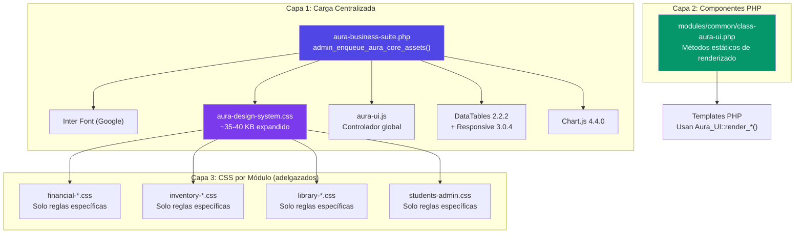

# 🎨 Plan de Acción: Design System Centralizado — Aura Business Suite

## 1. Diagnóstico del Estado Actual

### 📊 Auditoría de Assets CSS

| Métrica | Valor |
|---------|-------|
| Archivos CSS | **41** |
| Peso total sin minificar | **1.41 MB** (1,445 KB) |
| Archivo más pesado | `admin-styles.css` → **173.7 KB** |
| Top 5 por peso | `financial-accounts.css` (128 KB), `third-parties-directory.css` (97 KB), `transactions-list.css` (90 KB), `transaction-form.css` (71 KB), `pending-approvals.css` (67 KB) |
| Design System base | `aura-design-system.css` → **26 KB** (solo 1.8% del total) |
| Estimado de CSS duplicado | **~35-40%** en tablas, badges, botones y modales |

### 🏗️ Problemas Arquitectónicos Detectados

1. **Tailwind CDN cargado globalmente** — Se inyecta `cdn.tailwindcss.com?plugins=forms` en TODAS las páginas de Aura. Es un script JS de ~300KB que genera clases bajo demanda. **No se usa activamente** y puede causar conflictos con WP Admin y con el Design System propio.

2. **Design System parcialmente adoptado** — Solo 3 de 41 CSS dependen de `aura-design-system.css`:
   - `financial-accounts.css` (explícito)
   - `settings-page.css` (via dependencia)
   - `financial-categories.css` (via dependencia de áreas)

3. **Patrones HTML heterogéneos** entre módulos:
   - Módulo financiero moderno: usa `.aura-app-wrapper`, `.aura-glass-card`, `.aura-navbar`, estadísticas con iconos
   - Módulos legacy (Inventario, Biblioteca, Estudiantes): usan clases WP nativas (`page-title-action`, `wp-heading-inline`), sin hero banners, sin glass cards

4. **Selectores `!important` proliferados** — Detectados en prácticamente todos los CSS de módulo (sidebar filters, botones, paginación).

---

## 2. Patrones de Diseño de Referencia (Lo Mejor del Plugin)

> [!IMPORTANT]
> Estos 8 patrones son los que el usuario quiere estandarizar en TODO el plugin. Son el "estándar visual" aprobado.

### Patrón 1: Hero Banner con Glass Card ⭐
**Origen**: [categories-page.php](file:///c:/laragon/www/diserwp/wp-content/plugins/aura-business-suite/templates/financial/categories-page.php#L18-L38), [accounts-page.php](file:///c:/laragon/www/diserwp/wp-content/plugins/aura-business-suite/templates/financial/accounts-page.php#L20-L31)
```html
<header class="aura-glass-card aura-page-header">
    <div class="aura-page-header__icon"><span class="dashicons dashicons-category"></span></div>
    <div class="aura-page-header__content">
        <h1>Título de Página</h1>
        <p>Descripción contextual del módulo</p>
    </div>
    <div class="aura-page-header__badges">
        <span class="aura-badge aura-badge-blue" data-tooltip="...">N registros</span>
    </div>
</header>
```
**Estilo**: Fondo gradiente `linear-gradient(135deg, rgba(79,70,229,.90), rgba(109,40,217,.90))`, texto blanco, border-radius 16px, backdrop-filter blur, badges con tooltips.

---

### Patrón 2: Hero Banner Superior (Estilo Libro Mayor)
**Origen**: [user-ledger.php](file:///c:/laragon/www/diserwp/wp-content/plugins/aura-business-suite/templates/financial/user-ledger.php#L104-L186)
```html
<div class="aura-hero-header">
    <div class="aura-hero-content">
        <div class="aura-hero-icon-box"><span class="dashicons dashicons-book-alt"></span></div>
        <div class="aura-hero-titles">
            <div class="aura-hero-subtitle-row">
                <span class="aura-tag-badge">🏷 Módulo</span>
                <span class="aura-tag-badge aura-tag-secondary">📑 Subpágina</span>
            </div>
            <h1 class="aura-hero-title">Título Principal</h1>
            <p class="aura-hero-desc">Descripción detallada</p>
        </div>
    </div>
    <div class="aura-hero-actions">
        <button class="aura-btn aura-btn-primary">Acción Principal</button>
        <button class="aura-btn aura-btn-secondary">Acción Secundaria</button>
    </div>
</div>
```
**Uso**: Páginas que necesitan contexto visual amplio + acciones principales (exportar, imprimir, estadísticas).

---

### Patrón 3: Navbar Sticky con Auto-Shrink
**Origen**: [aura-design-system.css](file:///c:/laragon/www/diserwp/wp-content/plugins/aura-business-suite/assets/css/aura-design-system.css#L64-L157)
```html
<nav class="aura-navbar aura-nav aura-glass-card">
    <div class="aura-navbar-menu">
        <a href="#" class="aura-navbar-item aura-tab-btn active" data-tab="tab-x">
            <span class="dashicons dashicons-icon"></span> Tab Label
        </a>
    </div>
</nav>
```
**Comportamiento**: `position: sticky; top: 32px`, se encoge al hacer scroll (clase `.aura-navbar-shrink` vía JS), pills redondeadas (`border-radius: 30px`), glass background con `backdrop-filter: blur(12px)`.

---

### Patrón 4: Tarjetas de Estadísticas KPI con Tooltips
**Origen**: [user-dashboard.php](file:///c:/laragon/www/diserwp/wp-content/plugins/aura-business-suite/templates/financial/user-dashboard.php#L205-L276)
```html
<div class="aura-ud-stats-grid">
    <div class="aura-ud-stat-card income" data-tooltip="Descripción del KPI">
        <div class="aura-ud-stat-icon-wrap">
            <span class="dashicons dashicons-money-alt"></span>
        </div>
        <div class="aura-ud-stat-body">
            <div class="aura-ud-stat-label-wrap">
                <span class="aura-ud-stat-label">Nombre</span>
                <div class="aura-tooltip-wrap">
                    <span class="aura-help-icon"><span class="dashicons dashicons-editor-help"></span></span>
                </div>
            </div>
            <span class="aura-ud-stat-value">$12,345.67</span>
            <span class="aura-ud-stat-sub">Texto secundario</span>
        </div>
    </div>
</div>
```
**Variantes**: `income` (verde), `expense` (rojo), `balance.positive/negative`, `pending` (ámbar). Grid de 4 columnas en desktop, 2 en tablet, 1 en móvil.

---

### Patrón 5: Sidebar de Filtros Colapsable
**Origen**: [transactions-list.php](file:///c:/laragon/www/diserwp/wp-content/plugins/aura-business-suite/templates/financial/transactions-list.php#L140-L160), [reports-page.php](file:///c:/laragon/www/diserwp/wp-content/plugins/aura-business-suite/templates/financial/reports-page.php#L29-L40)
```html
<div class="aura-[page]-page"> <!-- Layout flex: aside + main -->
    <aside class="aura-filters-card">
        <div class="aura-filters-header">
            <div class="aura-filters-header-title">
                <span class="dashicons dashicons-filter" style="color: #3b82f6;"></span>
                <h3>Filtros</h3>
                <span class="aura-active-count-chip">N</span> <!-- Filtros activos -->
            </div>
            <button class="aura-toggle-sidebar-btn" id="toggle-filters">
                <span class="dashicons dashicons-arrow-left-alt2"></span>
            </button>
        </div>
        <div class="aura-filters-body">
            <div class="filter-section"><h4><span class="dashicons"></span> Label</h4> ... </div>
        </div>
    </aside>
    <main id="content-area">...</main>
</div>
```
**Comportamiento**: `position: sticky; top: 32px`, `max-height: calc(100vh - 150px)`, clase `.collapsed` para ocultar, animación `transition: all 0.3s ease`.

---

### Patrón 6: Filtros con Chips de Período Rápido
**Origen**: [user-dashboard.php](file:///c:/laragon/www/diserwp/wp-content/plugins/aura-business-suite/templates/financial/user-dashboard.php#L289-L297), [reports-page.php](file:///c:/laragon/www/diserwp/wp-content/plugins/aura-business-suite/templates/financial/reports-page.php#L112-L117)
```html
<div class="aura-quick-date-chips">
    <span class="aura-chips-label"><span class="dashicons dashicons-calendar"></span> Período Rápido:</span>
    <button class="aura-chip-btn" data-period="this_month">Este Mes</button>
    <button class="aura-chip-btn" data-period="last_month">Mes Ant.</button>
    <button class="aura-chip-btn" data-period="quarter">Trimestre</button>
    <button class="aura-chip-btn" data-period="this_year">Este Año</button>
    <button class="aura-chip-btn" data-period="all">Todo</button>
</div>
```
**Estilo**: Pills pequeños, selección activa con color primario, activa automáticamente campos de fecha.

---

### Patrón 7: Tabla Fluida (Zero Horizontal Scroll)
**Origen**: Principios aplicados en [transactions-list.php](file:///c:/laragon/www/diserwp/wp-content/plugins/aura-business-suite/templates/financial/transactions-list.php), [financial-accounts.css](file:///c:/laragon/www/diserwp/wp-content/plugins/aura-business-suite/assets/css/financial-accounts.css)
```css
/* Wrapper */
.aura-dt-wrapper {
    display: block; width: 100%; overflow-x: auto;
    border-radius: var(--aura-radius-md);
    border: 1px solid rgba(79,70,229,.10);
}
/* Tabla */
table.dataTable {
    width: 100% !important; table-layout: auto !important;
    font-family: 'Inter', sans-serif; font-size: 13px;
}
/* Cabeceras */
table.dataTable thead th {
    background: rgba(79,70,229,.07); font-size: 12px;
    text-transform: uppercase; letter-spacing: 0.05em;
}
/* Hover en filas */
table.dataTable tbody tr:hover { background: rgba(79,70,229,.04) !important; }
```
**Clave**: DataTables Responsive + child rows expandibles para columnas ocultas en móvil.

---

### Patrón 8: Acciones con Solo Iconos + Tooltips
**Origen**: Implementado en Caja Chica, expandir a todo el plugin
```html
<div class="aura-row-actions">
    <button class="aura-btn-action-icon aura-btn-view" data-tooltip="Ver detalles">
        <span class="dashicons dashicons-visibility"></span>
    </button>
    <button class="aura-btn-action-icon aura-btn-edit" data-tooltip="Editar">
        <span class="dashicons dashicons-edit"></span>
    </button>
    <button class="aura-btn-action-icon aura-btn-delete" data-tooltip="Eliminar">
        <span class="dashicons dashicons-trash"></span>
    </button>
</div>
```

---

## 3. Arquitectura Objetivo



---

## 4. Fases de Ejecución

### Fase 1: Núcleo — Enqueue Centralizado y Limpieza de Tailwind
**⏱ Tiempo estimado: 1-2 horas**

> [!CAUTION]
> Esta fase elimina la carga de Tailwind CDN. Es el cambio de mayor impacto y debe validarse visualmente en TODAS las páginas después de aplicarlo.

#### [MODIFY] [aura-business-suite.php](file:///c:/laragon/www/diserwp/wp-content/plugins/aura-business-suite/aura-business-suite.php)

1. **Eliminar** la línea de `wp_enqueue_script('tailwindcss-cdn', ...)` (línea ~1834-1841)
2. **Refactorizar** `admin_enqueue_scripts` para centralizar:
   ```php
   private function admin_enqueue_aura_core_assets($hook) {
       // Detección unificada de páginas Aura
       $is_aura_page = (
           strpos($hook, 'aura-') !== false ||
           strpos($hook, 'aura_') !== false ||
           strpos($hook, 'toplevel_page_aura') !== false ||
           (isset($_GET['page']) && strpos($_GET['page'], 'aura-') === 0)
       );
       if (!$is_aura_page) return;

       // 1. Fuentes
       wp_enqueue_style('aura-inter-font', 'https://fonts.googleapis.com/css2?family=Inter:wght@300;400;500;600;700;800&display=swap', [], null);

       // 2. Design System (siempre primero)
       wp_enqueue_style('aura-design-system', AURA_PLUGIN_URL.'assets/css/aura-design-system.css', [], AURA_VERSION.'.'.filemtime(...));

       // 3. DataTables (CSS + JS)
       wp_enqueue_style('datatables-css', '...', [], '2.2.2');
       wp_enqueue_style('datatables-responsive-css', '...', ['datatables-css'], '3.0.4');
       wp_enqueue_script('datatables-js', '...', ['jquery'], '2.2.2', true);
       wp_enqueue_script('datatables-responsive-js', '...', ['datatables-js'], '3.0.4', true);

       // 4. Chart.js
       wp_enqueue_script('chartjs', '...', [], '4.4.0', true);

       // 5. Controlador UI Global
       wp_enqueue_script('aura-ui-core', '...assets/js/aura-ui.js', [], ..., true);
   }
   ```
3. **Eliminar** las cargas duplicadas de `aura-design-system.css` y DataTables de los módulos individuales (ej: [class-financial-accounts.php](file:///c:/laragon/www/diserwp/wp-content/plugins/aura-business-suite/modules/financial/class-financial-accounts.php) líneas ~505-515)

---

### Fase 2: Expansión del Design System CSS
**⏱ Tiempo estimado: 3-4 horas**

#### [MODIFY] [aura-design-system.css](file:///c:/laragon/www/diserwp/wp-content/plugins/aura-business-suite/assets/css/aura-design-system.css)

Agregar los siguientes bloques canónicos que actualmente viven dispersos en CSS de módulos:

| Componente | Clases a crear | Extrae de |
|-----------|----------------|-----------|
| **Hero Header** | `.aura-hero-header`, `.aura-hero-content`, `.aura-hero-icon-box`, `.aura-hero-titles`, `.aura-hero-title`, `.aura-hero-desc`, `.aura-hero-actions`, `.aura-tag-badge` | `financial-user-dashboard.css`, CSS inline en `user-ledger.php` |
| **Stats Grid (KPIs)** | `.aura-stats-header`, `.aura-stat-card`, `.aura-stat-card.income/expense/capital/balance/count`, `.stat-icon-wrap`, `.stat-content`, `.stat-label`, `.stat-value` | `transactions-list.css` (líneas 200-400) |
| **Dashboard Stats** | `.aura-ud-stats-grid`, `.aura-ud-stat-card`, variantes `income/expense/balance/pending` | `financial-user-dashboard.css` |
| **Sidebar Filtros** | `.aura-filters-card`, `.aura-filters-header`, `.aura-filters-body`, `.filter-section`, `.aura-filter-chips-grid`, `.aura-chip-checkbox`, `.aura-active-count-chip` | `transactions-list.css` (líneas 48-300) |
| **Chips Período** | `.aura-quick-date-chips`, `.aura-chip-btn`, `.aura-date-preset-btn` | `financial-user-dashboard.css`, `financial-reports.css` |
| **Acciones Icono** | `.aura-row-actions`, `.aura-btn-action-icon`, variantes `.aura-btn-view/.edit/.delete/.approve/.reject` | `financial-accounts.css` |
| **Avatar** | `.aura-avatar-circle`, fallback con Dashicon, hover con borde primario | `third-parties-directory.css` |
| **Empty State** | `.aura-empty-state`, `.aura-empty-icon-box` | `financial-user-dashboard.css` |
| **Print Header** | `.aura-print-header`, `.aura-print-header__brand-box`, etc. | `financial-user-dashboard.css` |
| **Top Actions Bar** | `.aura-cat-top-actions`, `.aura-actions-left/right` | `financial-categories.css` |

**Meta**: `aura-design-system.css` pasa de **26 KB → ~40-45 KB**, pero absorbe **~350 KB** de CSS que se repite en otros archivos.

---

### Fase 3: Motor de Componentes PHP — `Aura_UI`
**⏱ Tiempo estimado: 3-4 horas**

#### [NEW] [modules/common/class-aura-ui.php](file:///c:/laragon/www/diserwp/wp-content/plugins/aura-business-suite/modules/common/class-aura-ui.php)

```php
class Aura_UI {

    // ─── CABECERA DE PÁGINA ─────────────────────────
    public static function render_page_header(array $args): void {
        // Renderiza: Hero Glass Card con icono, título, subtítulo y badges
        // $args: icon, title, subtitle, badges[], variant ('glass'|'hero')
    }

    // ─── BARRA DE ACCIONES SUPERIOR ──────────────────
    public static function render_top_actions(array $left = [], array $right = []): void {
        // Renderiza: .aura-cat-top-actions con botones a izquierda y derecha
    }

    // ─── TARJETAS KPI ────────────────────────────────
    public static function render_stats_grid(array $kpis): void {
        // $kpi: ['label'=>'', 'value'=>'', 'icon'=>'dashicons-x', 'variant'=>'income', 'tooltip'=>'', 'sub'=>'']
    }

    // ─── SIDEBAR DE FILTROS ──────────────────────────
    public static function render_filters_sidebar(string $id, array $sections, array $options = []): void {
        // Renderiza aside.aura-filters-card con secciones de filtros dinámicas
    }

    // ─── CONTENEDOR DE TABLA DATATABLES ──────────────
    public static function render_table_container(string $table_id, array $columns, array $options = []): void {
        // Genera wrapper + <table> con <thead> + clases canónicas + responsive
    }

    // ─── BOTONERA DE ACCIONES (SOLO ICONOS) ──────────
    public static function render_action_buttons(array $buttons): string {
        // Devuelve HTML de .aura-row-actions con botones .aura-btn-action-icon
    }

    // ─── MODAL ESTÁNDAR ──────────────────────────────
    public static function render_modal(string $id, string $title, callable $body, array $footer = []): void {
        // Overlay + content + header + body scrollable + footer con botones
    }

    // ─── AVATAR CON FALLBACK ──────────────────────────
    public static function render_avatar(string $image_url, string $name, string $type = 'user'): string {
        // Si $image_url vacío o placeholder → Dashicon. Si no →  circular
    }

    // ─── NAVBAR STICKY ───────────────────────────────
    public static function render_navbar(array $tabs, string $active_tab): void {
        // <nav class="aura-navbar aura-nav aura-glass-card"> con tabs pill
    }

    // ─── CHIPS DE PERÍODO ────────────────────────────
    public static function render_date_chips(array $periods = []): void {
        // Renderiza .aura-quick-date-chips con botones predefinidos
    }

    // ─── EMPTY STATE ─────────────────────────────────
    public static function render_empty_state(string $icon, string $title, string $message, string $action_url = ''): void {
        // Renderiza .aura-empty-state con icono, título y acción
    }
}
```

#### [MODIFY] [aura-business-suite.php](file:///c:/laragon/www/diserwp/wp-content/plugins/aura-business-suite/aura-business-suite.php)

Agregar al autoloader:
```php
require_once AURA_PLUGIN_DIR . 'modules/common/class-aura-ui.php';
```

---

### Fase 4: Migración Módulo por Módulo
**⏱ Tiempo estimado: 2-3 horas por paquete**

> [!IMPORTANT]
> Cada paquete se ejecuta de forma independiente. Después de cada paquete, se valida visualmente que no haya regresiones antes de continuar con el siguiente.

#### Paquete 1: Módulo Financiero (Ya parcialmente adoptado)
**Páginas**: Transacciones, Categorías, Reportes, Presupuestos, Bancos/Cuentas, Libro Mayor, Mis Finanzas, Análisis Visual, CapEx

| Template | Estado actual | Acción requerida |
|----------|:---:|-------------|
| `transactions-list.php` | 🟡 Parcial | Usar `Aura_UI::render_stats_grid()`, consolidar filtros sidebar |
| `categories-page.php` | 🟢 Moderno | Adoptar `Aura_UI::render_page_header()`, mantener D&D |
| `accounts-page.php` | 🟢 Moderno | Limpiar CSS duplicado, usar navbar canónico |
| `reports-page.php` | 🟡 Parcial | Sidebar ya funcional, consolidar a clase canónica |
| `user-dashboard.php` | 🟢 Moderno | Extraer KPIs a `Aura_UI`, limpiar CSS local |
| `user-ledger.php` | 🟢 Moderno | Hero banner → `Aura_UI::render_page_header('hero')` |
| `visual-analytics.php` | 🟢 Moderno | Consolidar print header |
| `budgets-page.php` | 🟡 Parcial | Adoptar design system |
| `capital-expenses-page.php` | 🔴 Legacy | Migración completa a wrapper + glass cards |

**CSS a adelgazar**:
- `transactions-list.css` (90 KB → ~50 KB): Mover sidebar, stats, badges al DS
- `financial-accounts.css` (128 KB → ~70 KB): Mover navbar, modales, botones al DS
- `financial-user-dashboard.css` (38 KB → ~15 KB): KPIs y chips ya centralizados
- `financial-reports.css` (54 KB → ~30 KB): Filtros y presets al DS

---

#### Paquete 2: Módulos Operativos (Inventario + Biblioteca)
**Páginas**: Equipos, Préstamos, Mantenimiento, Dashboard Inv., Libros, Préstamos Lib., Reservas, Dashboard Lib.

| Template | Estado actual | Acción requerida |
|----------|:---:|-------------|
| `inventory/equipment-list.php` | 🔴 Legacy | Agregar wrapper, hero header, filtros chip, acciones icono |
| `inventory/loans-list.php` | 🔴 Legacy | Tabla fluida + acciones icono |
| `inventory/dashboard.php` | 🟡 Parcial | KPIs estandarizados |
| `library/books-list.php` | 🔴 Legacy | Wrapper + hero + tabla fluida |
| `library/loans-list.php` | 🔴 Legacy | Wrapper + filtros + acciones icono |
| `library/dashboard.php` | 🟡 Parcial | KPIs estandarizados |

**Acción para cada template legacy**:
1. Envolver en `<div class="aura-app-wrapper"><div class="wrap aura-app-context">`
2. Reemplazar `<h1 class="wp-heading-inline">` por `Aura_UI::render_page_header()`
3. Reemplazar barra de filtros inline por `Aura_UI::render_filters_sidebar()` o filter bar chips
4. Reemplazar tabla cruda por `Aura_UI::render_table_container()`
5. Cambiar botones de acción de texto a solo iconos

---

#### Paquete 3: Módulos Administrativos y Académicos
**Páginas**: Estudiantes, Áreas, Certificados, Formularios

| Template | Estado actual | Acción requerida |
|----------|:---:|-------------|
| `students/list.php` | 🔴 Legacy | Wrapper completo + hero + tabla + acciones icono |
| `students/dashboard.php` | 🟡 Parcial | KPIs estandarizados |
| `students/enrollments.php` | 🔴 Legacy | Tabla fluida |
| `areas/admin.php` | 🟡 Parcial | Ya usa glass cards, consolidar |
| `certificates/*` | 🔴 Legacy | Migración completa |
| `forms/*` | 🔴 Legacy | Migración completa |

---

#### Paquete 4: Dashboard Principal y Páginas Globales
**Páginas**: Dashboard principal, Configuración, Permisos

| Template | Estado actual | Acción requerida |
|----------|:---:|-------------|
| `main-dashboard.php` | 🟡 Parcial | KPIs y módulos ya modernos, consolidar |
| `settings-page.php` | 🟡 Parcial | Ya depende del DS, limpiar redundancias |
| `permissions-page.php` | 🟡 Parcial | Limpiar CSS, adoptar toggles canónicos |

---

### Fase 5: Optimización de Rendimiento
**⏱ Tiempo estimado: 2-3 horas**

1. **Minificación CSS**:
   - Generar versiones `.min.css` para producción
   - Cargar la versión minificada cuando `SCRIPT_DEBUG` no esté activo:
     ```php
     $suffix = defined('SCRIPT_DEBUG') && SCRIPT_DEBUG ? '' : '.min';
     wp_enqueue_style('aura-design-system', "...aura-design-system{$suffix}.css");
     ```

2. **Server-Side Processing en DataTables** (módulos con >100 registros):
   - Patrón AJAX estándar: `draw`, `recordsTotal`, `recordsFiltered`, `data[]`
   - Aplicar en: Transacciones, Estudiantes, Equipos, Préstamos
   - Reducción de payload: de ~200KB JSON a ~5KB por página visible

3. **Lazy Loading de módulos CSS**:
   - Solo cargar `financial-*.css` en páginas financieras
   - Solo cargar `inventory-*.css` en páginas de inventario
   - Ya existe parcialmente, estandarizar el patrón

---

### Fase 6: Documentación y Guía de Desarrollo
**⏱ Tiempo estimado: 1 hora**

1. **Actualizar `prompt-maestro.md`** con reglas estrictas:
   - "TODO template nuevo DEBE usar `Aura_UI::render_*()` para cabeceras, tablas y modales"
   - "NUNCA crear CSS inline en templates PHP"
   - "SIEMPRE envolver páginas en `.aura-app-wrapper > .aura-app-context`"

2. **Limpieza CSS Legacy** post-migración:
   - Eliminar bloques muertos en CSS de módulo
   - Auditoría final de `!important` innecesarios
   - Estimación de reducción: **1.41 MB → ~0.85 MB** (40% menos)

---

## 5. Orden de Ejecución Recomendado

```mermaid
gantt
    title Roadmap de Implementación
    dateFormat  X
    axisFormat %s

    section Fase 1
    Enqueue centralizado + quitar Tailwind :a1, 0, 2
    
    section Fase 2
    Expandir aura-design-system.css :a2, 2, 6
    
    section Fase 3
    Crear class-aura-ui.php :a3, 4, 8
    
    section Fase 4
    Paquete 1 - Financiero :a4, 8, 11
    Paquete 2 - Inventario + Biblioteca :a5, 11, 14
    Paquete 3 - Estudiantes + Áreas :a6, 14, 17
    Paquete 4 - Dashboard + Config :a7, 17, 19
    
    section Fase 5
    Minificación + Server-Side :a8, 19, 22
    
    section Fase 6
    Documentación + Limpieza :a9, 22, 23
```



---

## 6. Plan de Verificación

### Por cada fase:
- [ ] **Validación PHP**: `php -l` en todos los archivos modificados
- [ ] **Validación Visual**: Navegar todas las páginas del módulo modificado en Chrome/Firefox
- [ ] **Sin scroll horizontal**: Verificar tablas en viewport de 1280px y 768px
- [ ] **WordPress Admin intacto**: Menú lateral, admin bar y footer sin alteraciones
- [ ] **Funcionalidad CRUD**: Crear, editar y eliminar registros sin errores JS

### Validación global final:
- [ ] Todas las páginas usan `.aura-app-wrapper` + `.aura-app-context`
- [ ] Hero banners uniformes en todos los módulos
- [ ] Tablas con DataTables Responsive + acciones solo iconos
- [ ] KPIs con el mismo grid y estilo visual
- [ ] Filtros sidebar consistentes en estructura y comportamiento
- [ ] Peso total CSS < 900 KB (objetivo: reducción del 40%)
- [ ] No hay cargas de Tailwind CDN

---

## 7. Open Questions / Decisiones Pendientes

> [!IMPORTANT]
> **¿Quieres que comience con la Fase 1 (enqueue centralizado + eliminar Tailwind) directamente la próxima sesión, o prefieres que primero ajuste el plan de alguna forma?**

> [!NOTE]
> **DataTables local vs CDN**: Actualmente se cargan desde CDN (`cdn.datatables.net`). ¿Prefieres descargarlas localmente dentro de `assets/vendor/` para eliminnar la dependencia de internet? Esto agregaría ~180 KB al plugin pero mejoraría la confiabilidad offline.

> [!NOTE]
> **Módulos prioritarios**: El orden actual prioriza Financiero → Inventario → Biblioteca → Estudiantes. ¿Hay algún módulo que necesites modernizado con mayor urgencia?
